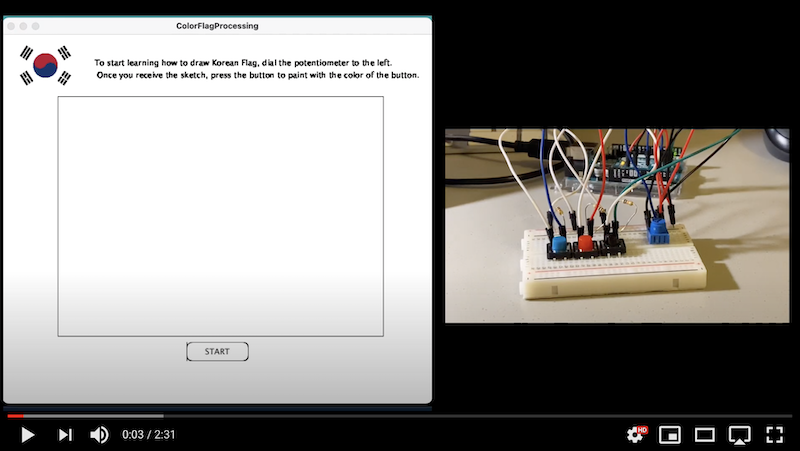
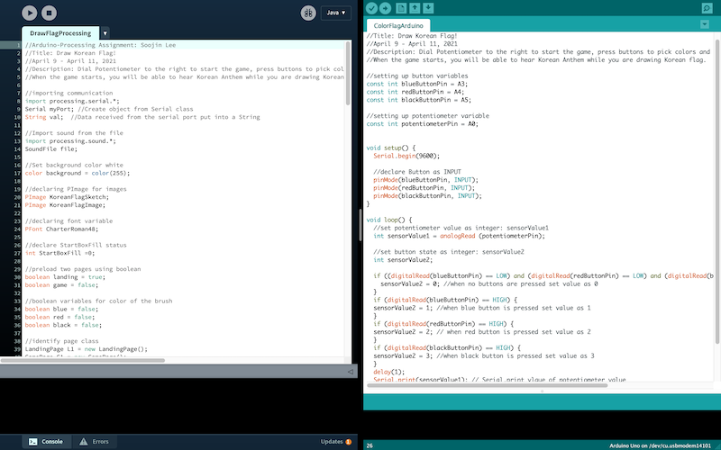

# Arduino-Processing Assignment: Draw Korean Flag (Tae-Guk-key) !

## Description
Fort this week, I was instructed to make a simple game that involves some kind of communication between Arduino and Processing. Following the instruction, I created a drawing game that you use Arduino Button to select the color of the paint and use a mouse to digitally paint the Korean flag. When Processing starts to run, you will see a landing page with a following instruction. 

1. To start this game, dial the potentiometer to the right. 
2. Once the game start, you will receive the Korean flag sketch and the Korean Anthem will start to play.
3. Press the button on the Arduino to pick the colors and press mouse to start coloring the Korean flag. 

## Inspiration


My inspiration for this game was the coloring book. Coloring book is a type of book that contains line art, whcih you can color using crayons, colored pencil, paint or other artistic media. Recently, coloring book has become very popular. I think this is because it helps you channel your inner artist, de-stress, and bring a sense of peace. As it is a great source of relaxation and a fun activity to do, I wanted to create a coloring book using arduino and processing. 


As a child, I remember learning how to draw Korean flag by tracing and painting the flag over and over again. By drawing it myself, I was able to learn how to draw and and deeply appreciate the beauty of Korean flag. As a Korean, I love South Korea flag. Especially since each element of the flag has a meaningful background . 

[You can read more about Korean flag here.](https://theculturetrip.com/asia/south-korea/articles/a-brief-history-of-the-south-korean-flag/)

Apart from the meaning of the flag, it is simply aesthetically pleasing to look at. The white spaces combined with the blue, red and black color shceme makes its simplicity stand out. As Korean, I love Korean flag, and I wanted to share this beautiful flag with more people, hence I created a fun game where you can learn how to draw Korean flag while listening to Korean Anthem. 

## Schematic 

The schematic of this idea is below, which is very simple compared to previous Arduino assignments. It uses one potentiometer and three buzzers.


## Final Circuit


## Game Demonstration Video 

Click below to see the Korea flag Drawing Game Demonstration. 

**In the video I say turn the potentiometer to LEFT but it is a mistake. Instead, turn the potentiometer to the RIGHT !!!**

[](https://youtu.be/A0OAqD5EGqc)

## Demo GIF  

Below is the quick look of starting game using potentiometer:


Below is the quick look of coloring using mouse press and button press:


## Challenge & Process

For this project, the difficulty was not in building the physical circuit, but to code the Arduino and Processing in a way that they communicate with each other.  I created a game that is completely different from the previous exercises, which added an extra challenge to this project. I have been only working on Arduino projects for the last few weeks that I had to brush off my Processing skills, from importing the sound files and creating Classes. I used my previous works as the reference point. Yet, despite all these difficulties, I had a lot of fun working on this project. It was like piecing a puzzle together. Now that I have worked on many projects, I was able to use bits of information I have got from here and there, and make the best use of the skills that I have acuiqred so far to create this project.

### Continuous Line Drawing

I had the idea of using mouse to paint/draw on Processing but I didn't know how to code this. While figuring out how to enable this, I realized that in a way, drawing is an act of drawing a continuous line. Therefore, I searched on how to draw a continuous line on Processing. It was much less complex than I thought it would be. Using pmouseX variable, drawing a continuous line was surprisingly easy to code. However, without knowing this pmouse variable, it was so difficult creating a function that draws. Basically, pmouseX and pmouseY variables store the mouse values from the previous frame, which creates a "drawing" effect. 
Here is a reference page to Continuous Line drawing https://processing.org/examples/continuouslines.html
and this is the code below:

````

void setup() {
  size(640, 360);
  background(102);
}

void draw() {
  stroke(255);
  if (mousePressed == true) {
    line(mouseX, mouseY, pmouseX, pmouseY);
  }
}

````

### JPG Image Masking Continuous Drawing

I tried to use the code above to enable drawing continuous line on the Korea flag sketch. However, when I run the code, although the code was identical to the example,it didn't work. It turned out that the line being made, but it is not visible, as the jpg image was blocking the drawing. I tried to rearranging the order, but it was not the issue of the order. I didn't know how to code it in a way that draws continuous line on the image. Therefore, as an alternative solution to this problem, I created a png file of a Korea flag line sketch using Adobe Photoshop:


Since it is a png file that supports the transparency, I could draw the continuous line without being masked by the image file. 

Similarly, there was an issue with the background. When I had a background() for the void drawing(), the drawings created by the continuous lines were invisible as it was masked by the background, just like how the jpg image blocked the drawing. 

### Buffer Value for Mapping

When mapping the value of the potentiometer output with the width of a rectangle that fills the Start button to grey, I added the buffer value. Originally, I wanted the game to start when the filling of rectangle is complete. Therefore, I originally coded like this:

````
StartBoxFill = (int)map(int(values[0]), 0, 1023, 0, 100);  //map potentiometer value to StartBoxFill width
      if (int(values[0])= 1023) { //if the potentiometer is dialed to the right
        game = true;
````
which is theoretically errorless, but since the sensors are not very sophisticated, although I dial the potentiometer to the far right, the value was not 1023, but it was continuously fluctuating between 900-1023. Therefore, the game page appeared with a flicker on the screen. 

Therefore, I ended up adding some buffer value to the mapping value and coded in a whay that if the value exceeds 800, the game starts. 

````
 StartBoxFill = (int)map(int(values[0]), 0, 1023, 0, 100);  //map potentiometer value to StartBox width
      if (int(values[0])>= 800) { //if the potentiometer is dialed to the right
        game = true; //start Game
````

### No Black Button? Think out of the Box!

I needed buttons for red, blue and black colors. I had blue and red buttons, but I didn't have black button in my Arduino kit. Therefore, I used black Sharpie to color the green button and turned it to a black button. Sometimes, you need to work with what you have got and use creativity to find a solution! 


### Connecting Arduino to Processing 

Getting Arduino and processing to communicate each other was challenging. Without a profound understanding of the concept and the mechanism of how the communication works between the two, I couldn't adapt the class example to my project. Therefore, along with the class material, I used this website (
https://learn.sparkfun.com/tutorials/connecting-arduino-to-processing/all), to understand the concept and step-by-step procedure on putting the two programs into communicaiton. 

## Interesting Finding



One interesting thing that I found out working on this project is that Arduino has much cleaner and visually comfortable interface to work on. I did not notice this when I was working on them individually, but now that I work on two programs simultaneously, I realized that the design and the layout of the Arduino is much more user-friendly. I wonder if this is a personal preference or the actual deisgn aspect of the Arduino that makes it easier for user to use. 

## Evaluation
I am happy with the outcome of this highly personal and creative project. For this project, I didn't put the interactivity of Processing sending data to Arduino to stimulate the action. For this final project, building on this, I woudld like to have the interaction going on the both side, Processing stimulating an event on Arduino and vise-versa. 

