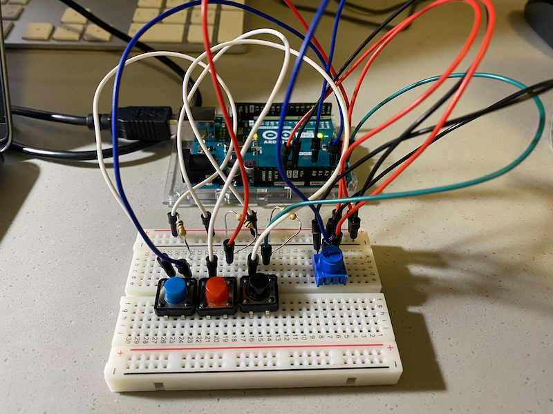

# Arduino-Processing Assignment: Draw Korean Flag (Tae-Guk-key) !

## Description
Fort this week, I was instructed to make a simple game that involves some kind of communication between Arduino and Processing. Following the instruction, I created a drawing game that you use Arduino Button to select the color of the paint and use a mouse to digitally paint the Korean flag. When Processing starts to run, you will see a landing page with a following instruction. 

1. To start this game, dial the potentiometer to the right. 
2. Once the game start, you will receive the Korean flag sketch and the Korean Anthem will start to play.
3. Press the button on the Arduino to pick the colors and press mouse to start coloring the Korean flag. 

## Inspiration

My inspiration for this game was the coloring book. Coloring book is a type of book that contains line art, whcih you can color using crayons, colored pencil, paint or other artistic media. Recently, coloring book has become very popular. I think this is because it helps you channel your inner artist, de-stress, and bring a sense of peace. As it is a great source of relaxation and a fun activity to do, I wanted to create a coloring book using arduino and processing. 

As a child, I remember learning how to draw Korean flag by tracing and painting the flag over and over again. By drawing it myself, I was able to learn how to draw and and deeply appreciate the beauty of Korean flag. As a Korean, I personally love South Korea flag. Especially since each element of the flag has a meaningful background . 

[You can read more about Korean flag here.](https://theculturetrip.com/asia/south-korea/articles/a-brief-history-of-the-south-korean-flag/)

Apart from the meaning of the flag, it is simply aesthetically pleasing to look at. The white spaces combined with the blue, red and black color shceme makes its simplicity stand out. As Korean, I love Korean flag, and I wanted to share this beautiful flag with more people, hence I created a fun game where you can learn how to draw Korean flag while listening to Korean Anthem. 

## Schematic 

The schematic of this idea is below, which is very simple compared to previous Arduino assignments. It uses one potentiometer and three buzzers.

## Final Circuit

