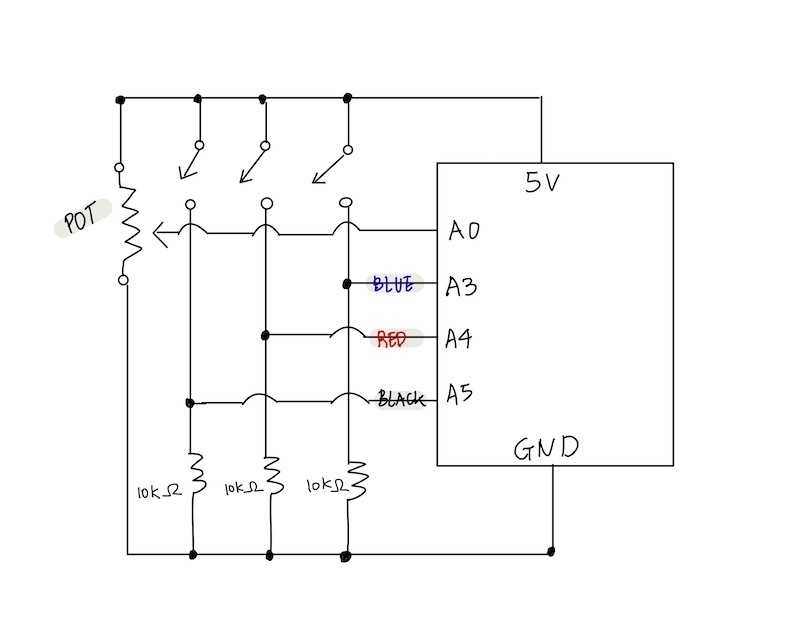

# Arduino-Processing Assignment: Draw Korean Flag (Tae-Guk-key) !

## Description
Fort this week, I was instructed to make a simple game that involves some kind of communication between Arduino and Processing. Following the instruction, I created a drawing game that you use Arduino Button to select the color of the paint and use a mouse to digitally paint the Korean flag. When Processing starts to run, you will see a landing page with a following instruction. 

1. To start this game, dial the potentiometer to the right. 
2. Once the game start, you will receive the Korean flag sketch and the Korean Anthem will start to play.
3. Press the button on the Arduino to pick the colors and press mouse to start coloring the Korean flag. 

## Inspiration


My inspiration for this game was the coloring book. Coloring book is a type of book that contains line art, whcih you can color using crayons, colored pencil, paint or other artistic media. Recently, coloring book has become very popular. I think this is because it helps you channel your inner artist, de-stress, and bring a sense of peace. As it is a great source of relaxation and a fun activity to do, I wanted to create a coloring book using arduino and processing. 


As a child, I remember learning how to draw Korean flag by tracing and painting the flag over and over again. By drawing it myself, I was able to learn how to draw and and deeply appreciate the beauty of Korean flag. As a Korean, I love South Korea flag. Especially since each element of the flag has a meaningful background . 

[You can read more about Korean flag here.](https://theculturetrip.com/asia/south-korea/articles/a-brief-history-of-the-south-korean-flag/)

Apart from the meaning of the flag, it is simply aesthetically pleasing to look at. The white spaces combined with the blue, red and black color shceme makes its simplicity stand out. As Korean, I love Korean flag, and I wanted to share this beautiful flag with more people, hence I created a fun game where you can learn how to draw Korean flag while listening to Korean Anthem. 

## Schematic 

The schematic of this idea is below, which is very simple compared to previous Arduino assignments. It uses one potentiometer and three buzzers.



## Final Circuit


## Game Demonstration Video 

Click below to see the Korea flag Drawing Game Demonstration. 

**In the video I say turn the potentiometer to LEFT but it is a mistake. Instead, turn the potentiometer to the RIGHT !!!**

[](https://youtu.be/A0OAqD5EGqc)

## Demo GIF  

Below is the quick look of starting game using potentiometer:


Below is the quick look of coloring using mouse press and button press:


## Challenge & Process

For this project, the difficulty was not in building the physical circuit, but to code the Arduino and Processing in a way that they communicate with each other.  I also created a game that is completely different from previous exercises, a drawing game, which added an extra challenge to the project. I have been working on Arduino projects only for the last few weeks that I had to brush off my Processing skills. For example, I had to revise on how to import the sound files and to create Class. I used my previous work as a reference point. However, despite all these difficulties, I had a lot of fun working on this project. It was like piecing a puzzle together; now that I have worked on many projects, I tried to code with bits of informations I have got from here and there, and tried to make the best use of the skills that I have acuiqred so far. 

### Continuous Line Drawing

I had the idea of using mouse to paint/draw on Processing but I didn't know how to code this. In a way, drawing is an act of drawing a continuous line. Therefore, I searched on how to draw a continuous line on Processing. Using pmouseX variable, drawing a continuous line was surprisingly easy to code. However, without knowing this variable, it was so difficult. Basically, pmouseX and pmouseY variables store the mouse values from the previous frame, which creates a "drawing" effect. 

````

void setup() {
  size(640, 360);
  background(102);
}

void draw() {
  stroke(255);
  if (mousePressed == true) {
    line(mouseX, mouseY, pmouseX, pmouseY);
  }
}

````

### JPG file that masks the Drawing
Once I tried to use the code above to draw continuous line on the Korea flag sketch, the continuous line was not visible. When I run the code on the separate empty pde file, it works but if it was to apply on my project, it didn't work. It turned out that the line being made, but it is not visible since the jpg image is blocking the drawing. Therefore, as a solution to this problem, I created a png file of a Korea flag line sketch using Adobe Photoshop:


Since it is a png file, which supports the transparency, I could draw the continuous line without being masked by the image file. 

Another issue was the background. When I had background in the void drawing(), the drawings created by the continuous lines were masked by the background that it was not visible, just like how jpg image that blocks the drawing. 

### Buffer 
When mapping I added the Buffer value because when I set it as 1023, the receiving was very unstable. 


### Connecting Arduino to Processing 

Getting Arduino and processing to communicate each other was challenging. It was crucial to have a profound understanding of the concept and the mechanism of the  how the communication works between the two. Therefore, along with the class material, I used this website (
https://learn.sparkfun.com/tutorials/connecting-arduino-to-processing/all), which helped me immensely with the step-by-step instruction on how to put the two programs into communicaiton. 

## Interesting Findings


One interesting thing that I found out is that Arduino has much cleaner, visually comfortable interface to work. I did not notice this when I was working on them individually, but now that I work on both programs simultaneously, I found out that the design and the layout of the Arduino is much more user-friendly. I wonder if this is a personal preference or the heuristic design aspect of the Arduino that makes it easier for user to use. 

## Evaluation
I am happy with the outcome of this highly personal and creative project. For this project, I didn't put the interactivity of Processing sending data to Arduino to trigger some action. For this final project, building on this, I woudld like to have the interaction going on the both side, Processing triggering an event on Arduino and vise-versa. 

