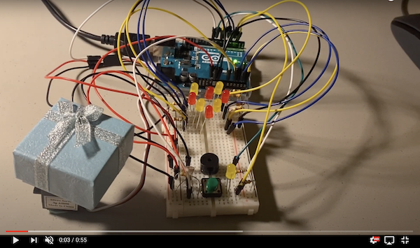
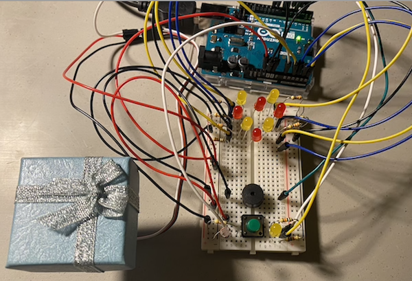
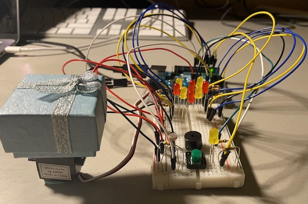
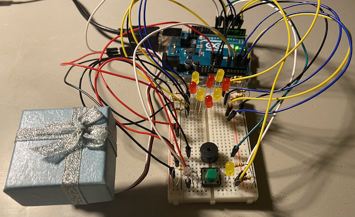
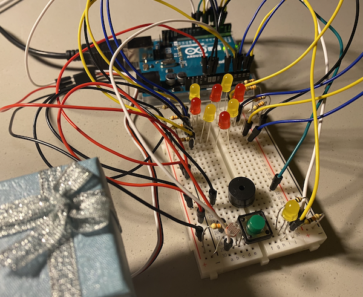
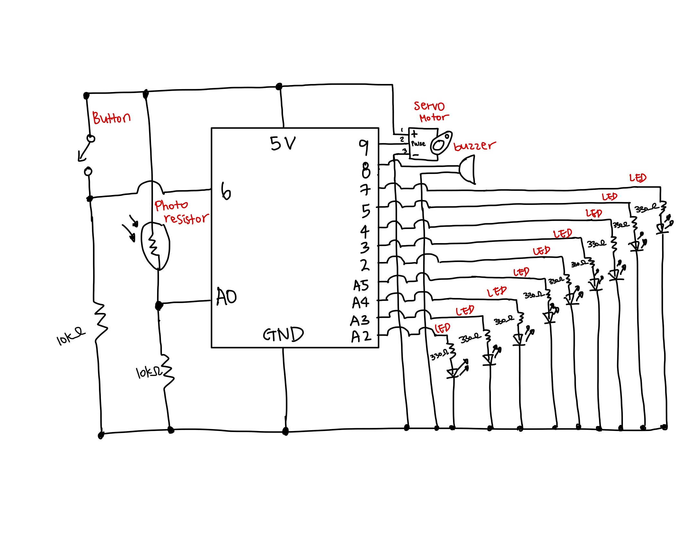

# Arduino Sound Assignment: Epic Birthday Celebration! 

## Description 
For this weeek, I was instructed to make a music instrument using both digital and analog sensors. Following an instruction, I created an all-in-one birthday celebration kit that you can use to not only play a birthday song but also wish your friend, family, or beloved ones with cute surprises. 

The month April is a special month for my family. Last week, I celebrated both my parents' birthday and their anniversary. Since I live far away from my parents, although I wanted to physically be there with them to celebrate their birthday, all I could do was to give them a video call and wish them a happiest birthday. Therefore, using Arduino, I made a creative birthday kit that I can use to wish them a happy birthday. Apart from creating a speaker that plays a birthday song, I tried to simulate the birthday celebration using Arduino devices; the experience of turning off the room light, lighting up the candle, singing a happy birthday song, decorating room cute with heart fairy lights, blowing the candle, and even gifting a birthday present. 

### Instruction:

This device has four components. A Birthday Gift, Birthday Song, Candle, and a Heart shaped fairy light. 

1. Make the room dark to light up the candle (Cover photoresistor with your finger)
2. If the room is dark, the candle will light up. (Yellow LED light will turn on)
3. Press Green Button to play a 'Happy Birthday' Song. (It only works while the candle is lighted)
4. The 'Happy Birthday' song Will play, Heart Shaped Fairy Light will turn on and the Gift box will rotate
5. Once the song is over, unpress the Green Button to stop the song
6. Make a wish, and blow the candle (Uncover photoresistor to let the light in) 
7. Present a gift (open a gift box)

## Final Game Demo

A complete guidance to celebrate the most epic birthday with this arduino birthday kit is demonstrated in the video below:

## Final Circuit

Since this project has multiple components, I took final circuit from different angles. 

### Circuit 1

### Circuit 2

### Circuit 3

### Circuit 4

## Schematic

For this week, although I had a vague idea on what inputs/outputs I want to use for specific purposes;

- Yellow LED light for the candle on a birthday cake

- Yellow LED & Red LED for the heart-shaped fairy light

- Photoresistor to adjust the room light 

- Servo Motor that showcases the gift

- Piezo Buzzer that plays a birthday song 

- Button to start the celebration (music, fairy light, and the gift)

However, because I was unsure of how many LED lights will be used to create a heart shaped fairy light, I first built the circuit, and then drew the schematic. 

The schematic for this project is below:

### Tips on Schematic

- Since I used a lot of output LED lights, I tried to balance the left (input) and right(output) side of the schematic. For example, I put photoresistor, which can be on the either side of the schematic, on the left. I also drew the breadboard on the leftside of the paper.

- I labelled inputs/outputs with red to make it easier for you to read the schematic

- I filled-in the circles for the ones that are connected, and left the circle unbfilled for the ones that are not connected e.g switch button

- When the two lines intersect, I added a semicircle curve to reduce any confusion of two lines being connected

There are some of the efforts I put to make the schematics more readable. However, I still feel like it is a bit cramped. I want to learn some more TIPs on drawing well ordered and organized schematics

**Feel Free to Write down your TIPS on drawing Schematics Here:**

## Challenges & Process Explanation 

### Build circuit with 9 lights, 1 button, 1 photoresisotr, 1 servo motor on small breadboard

Since I used a lot of LED lights and other INPUT/OUTPUT sources for this project, it was

### Assigning Pins to Appropriate Number

For this project, I used almost all the pins available that it was crucial for me to make a effecient use of pins since certain functions such as tone() function or Servo.write() function will interfere the function of some actuators on specific pins, it was tricky tyring to avoid this. 

- tone() function interfere with PWM output on pins 3 & 11
- Servo.write() function interfere with PWM output on pins 9 & 10

I also avoided using Pins 13/0/1 as Digital Input because they may create some issues like blinking at the start start of the program. 

### Destroyed Piezzo Buzzer Leg

As soon as I start building the physical circuit, I faced the challenge. 

The lesson learnt from this experience is that 'You can't build it when you destroy your device!'

but I also learnt a lesson that 'You can always find a solution!'

I broke the leg of the lesson learnt here is that I will need to be more careful with the equipments. I tried to fix it by using bluetag to hold the leg but it was not very stable. 

Meanwhile, I started to build heart shape 

I got my piezo buzzer replaced by professor Michael Shiloh. 
### 
