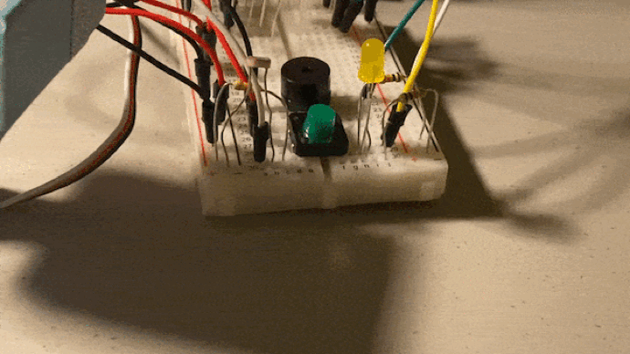
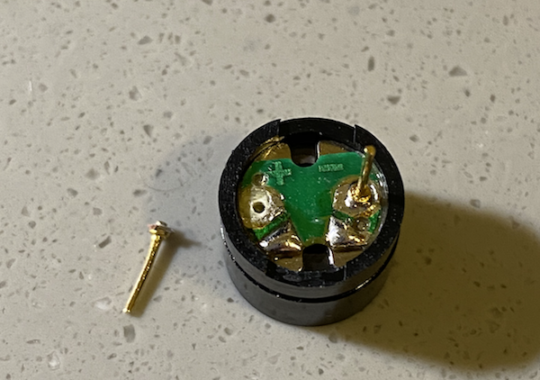

# Arduino Sound Assignment: Cute Birthday Celebration! 

## Description 
For this weeek, I was instructed to make a music instrument using both digital and analog sensors. Following an instruction, I made an all-in-one birthday celebration kit that you can use not only to play a birthday song but also to wish your friend, family, or beloved ones a happy birthday with a cute surpris that includes Heart-shaped Fairy Light, a gift and a birthday cake with a candle!

The month April is a very special month for my family. Last week, I celebrated both my parents' birthday and their anniversary. Since I live far away from them, although I wanted to physically be there with my parents to celebrate their birthday, all I could do was to give them a video call and wish them a happy birthday. Therefore, using Arduino, I made a birthday kit that I can use to wish them a happy birthday in a creative way. Apart from the speaker that plays a birthday song, I tried to simulate the usual birthday celebration. I tried to simulate the experience of turning off the room light, lighting up the candle, singing a happy birthday song, decorating room cute with heart fairy lights, blowing the candle, and even gifting a birthday present; all using Arduino devices.

### Instruction:

It has four main components: A Birthday Gift, Birthday Song, Candle, and a Heart shaped fairy light. 

1. Make the room dark to light up the candle (Cover photoresistor with your finger)
2. If the room is dark, the candle will light up. (Yellow LED light will turn on)
3. Press Green Button to play a 'Happy Birthday' Song. (It only works while the candle is lighted)
4. The 'Happy Birthday' song Will play, Heart Shaped Fairy Light will turn on and the Gift box will rotate
5. Once the song is over, unpress the Green Button to stop the song
6. Make a wish, and blow the candle (Uncover photoresistor to let the light in) 
7. Present a gift to the Birthday Person (open a gift box)

## Demonstration 

A complete guidance to celebrate a cute birthday using Ardunio is demonstrated in the video below:

### Heart Fairy Light

### Gift Presentation

### Light up Candle 

## Final Circuit

Since this project has multiple components, I took final circuit from different angles. 

### Circuit 1

### Circuit 2

### Circuit 3

### Circuit 4

## Schematic

For this week, although I had a vague idea on what inputs/outputs I want to use for specific purposes;

- Yellow LED light for the candle on a birthday cake

- Yellow LED & Red LED for the heart-shaped fairy light

- Photoresistor to adjust the room light 

- Servo Motor that showcases the gift

- Piezo Buzzer that plays a birthday song 

- Button to start the celebration (music, fairy light, and the gift)

However, because I was unsure of how many LED lights will be used to create a heart shaped fairy light, I first built the circuit, and then drew the schematic. 

The schematic for this project is below:

### Tips on Schematic

- Since I used a lot of output LED lights, I tried to balance the left (input) and right(output) side of the schematic. For example, I put photoresistor, which can be on the either side of the schematic, on the left. I also drew the breadboard on the leftside of the paper.

- I labelled inputs/outputs with red to make it easier for you to read the schematic

- I filled-in the circles for the ones that are connected, and left the circle unbfilled for the ones that are not connected e.g switch button

- When the two lines intersect, I added a semicircle curve to reduce any confusion of two lines being connected

There are some of the efforts I put to make the schematics more readable. However, I still feel like it is a bit cramped. I want to learn from my peer colleagues on how draw a well ordered and organized schematics

## Challenges & Process Explanation 

### Building heart-shaped LED light

Since I had a limited space on the breadboard, it was difficult creating a pefect heart shape. I tried to make a decent heart-shape using minimum number of LED lights. I ended up using 8 LED lights for a heart shape. In order to create this shape, I had to position LED light legs in specific spots to make a symmetrical shape. It was also tricky remembering which leg is the shorter leg. I had to pull out the legs and put them back in to find out which row should be connected to the GND (the shorter leg).

### Destroy Piezzo Buzzer Leg

As soon as I start building the circuit, I faced the major challenge. As I tried to build a circuit for the piezzo buzzer, I found out that one leg of the piezzo buzzer was broken.

I tried to find an alternative, but it is the quintessential part of my project, I couldn't replace the buzzer with another component. I use bluetag and super glue to stick the leg back, but despite my effort, the buzzer did not work. 

From this experience, I learnt that I will need to take care of kits better and put it in and out of the breadboard more gently because 'You can't build a project when you destroy your device!'

but I also learnt a lesson that 'You can always find a solution!' Thanks to professor Michael Shiloh, I was able to get the Piezzo Buzzer replaced to a new one. 

### Unnecessary use of Resistor

During the process of rebuilding the circuit, I accidently used a 330 ohm resistor for the buzzer, while buzzer does not require a resistor. Therefore, when I run the program, the output of the sound from the buzzer was so faint that I could not hear it. So I thought the buzzer was not working and tried to fix the code. Later, I found out that the sound was coming from the buzzer but since the resistor restrict the amount of current that flows into the buzzer, the level of the sound was too low. 

### Assigning Pins to Appropriate Number

For this project, I used almost all the pins available that it was crucial for me to make a effecient use of pins since certain functions such as tone() function or Servo.write() function will interfere the function of some actuators on specific pins, it was tricky tyring to avoid this. 

- tone() function interfere with PWM output on pins 3 & 11
- Servo.write() function interfere with PWM output on pins 9 & 10

I also avoided using Pins 13/0/1 as Digital Input because they may create some issues like blinking at the start start of the program.
