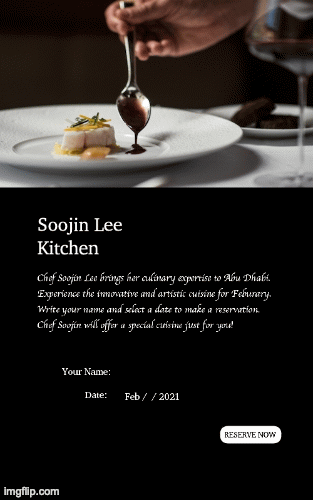
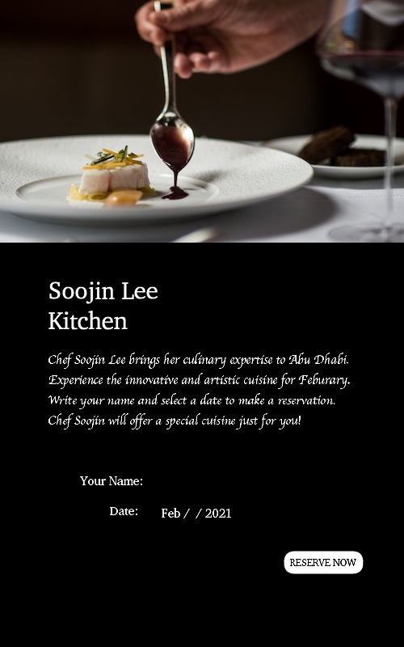
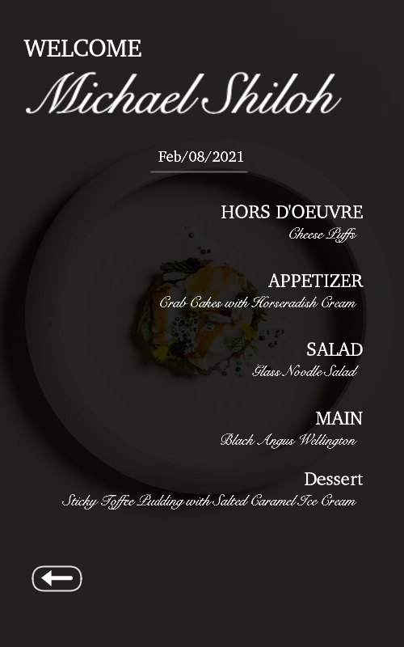
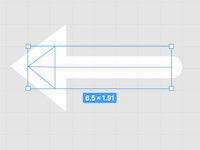

# Assignment 4:Data visualization & Generative Text

## Title: Special Full-Course Dinner Reservation 

### Ideation:

Recently, I have been watching a TV show called Masterchef and I often imagine myslef becoming a star chec and opening a fine-dining restaurant. When I open the restaurant, instead of having a fixed menu choices, I want to have a system where the menu changes daily and customize it to individual customers. With this in mind, having learnt how to load data and display text on Processing, for this project I created a full-course dinner reservation system where users can input personal information to receive a personalized menu with five-course dishes are randomly selected from the loaded data. 

### Overall Concept:

This project generates a personalized five-course meal menu based on the input the users put. It is a simulation of making a reservation for a fine dining restaurant, where users input personal information like his/her name and date of reservation and receive an invitation card with the list of five-course meal menu that is determined randomly based on the different options listed in the table in the .csv file. The menu consists of: hours d'oeuvre, appetizer, salad, main, and dessert. If users are unsatisfied with the recommended menu or want to make another reservation, they can click a return button to reset and restart. 

### Final Product

Below is the gif file of the Soojin's Kitchen Reservation demonstration:

### Description 

When the program runs, users land on the mainpage that introduces Chef Soojin and her restaurant "Soojin Lee Kitchen". I created an arbitrary restaurant for this projecet using my name, imagining that I am a star chef with my own restaurant. 

This page consists of three elements. An image of the elegent dish on top, word description of the restaurant in the middle, and a section where users type in their name and the date of reservation to make a reservation. 

Image of the landing page is attached below:

Once Users have typed in their name, chose preferred date, and clicked Reserve Now Button, they will receive a WELCOME card that includes:

- The name of a person who made a reservation ("Welcome **name**)
- The date (Feb/**date**/2021)
- The list of five-course dishes randomly chosen from the table in the csv file. 

Image of the menu page is attached below:

This is an example of a reservation under a customer named Michael Shiloh on the date of Feburary 8th, 2021.

Users can have a look at the menu and if he/she is unhappy with the choice of dishes, they can click the return arrow button to return the the landing page and make another reservation, which will give different options for the dishes. 

### Process & Challenges & Interesting Lessons Learnt

**Display user-input information**

To allow users to input their names and date, I had to create two strings "name" and "day". I then assigned events to the keyboard, where the string value changes based on what key is pressed. For string "name" it inputs the value when alphabet keys are pressed while for the string "day", it inputs the value when the number keys are pressed.  

As the user type-in, the value shows on the cover page and the same input is also shown on the Menu page. 

**Display random dishes selected from the csv.file**

Although we have covered how to import csv data process it, since it is my first time processing data, everything was confusing in the beginnging and I didn't know where to start. Reading Daniel Shiffman's Tutorial on "Data and Manipulating Strings", I have revisioned the structure of data processing. 

1. Load data in Table
2. Create a string to the variables 
3. Import random variables from the table to the string
4. Display string in the form that you want (in this case, text)

I have created data in the form of Table using excel sheet. Once I have saved it as a csv cfile, on Processing, I created five strings on the Processing,horsdoeuvre_c;, appetizer_c;, salad_c;, main_c;, dessert_c;, one for each column. I then get data from the csv file (String horsdoeuvre[] = table.getStringColumn("horsdoeuvre") and used horsdoeuvre_c = horsdoeuvre[int(random(0, 6))]; to randomly choose a variable from the data. Finally, I displayed the data it in the form of text (text(horsdoeuvre_c, 440, 295);)

**Assigning Keys**

To enable users to input names and date by typing-in information, I created void keyPressed and assigned keys to strings using if() statement. 
Since users are expected to input two different types of informations; name and date, I have assigned number keys to "day" string, and assigned alphabet keys to "name" string. 

One challenge I faced was finding the key name for space bar. I wanted to allow users to use spacebar to make a space between their first and last name but I couldn't find the appropriate name for this key. During the research I found out that there exists keyCode such as keyCode == 32 represents space bar. I also used these keyCodes as a shortcut to assign alphabets to name string. Instead of assigning each alphaet individually, I used (keyCode >= 65 && keyCode <= 90) to include al the alphabets. 

**Reverse/Delete (using substring)**

When users input the wrong information, I wanted them to use backspace key to delete the input. It was challenging learning how to do this. I used substring to reduce the string length by one when the BACKSPACE key was pressed. The issue that has not been solved yet is learning how to individually assign BACKSPACE for the string "Name" and the string "Day". When both are assigned with BACKSPACE, everytime when user press BACKSPACE, it reduces .length for both Name and Day. Since this is obviously not what I wanted, I ended up dedicating BACKSPACE for String name only. Therefore, when the BACKSPACE is pressed, it erases Name but users cannot erase number when he/she makes a mistake. 

**Creating Button**

I created a button using voidmouseClicked(). When the mouse is clicked on the shape of the button, it activates the event. I used pintln (mouseX,mouseY) to measure the size and the positionoing of the button and activated mouseClick() Event only within the range of the shape. The event is operated using Boolean of setting true or false for drawing pages. Therefore, buttons are used to navigates through two pages; the coverpage and the menu page. I initialized Boolean differently for each page so that when one page is displayed, another page is not displayed. 

**After Event, Allow Second Event**

I wanted to have a system where useres can only press the reservation button when they have made an entry of their name and the date. Therefore, I have assigned mouseClicked() event to function only when the length of the string name and day is bigger than zero. 

**Adding Images**

This was my first project adding images to the program. It was relatively a straightforward process and I have used tint(number value,number value) to adjust the transparency of the image.

**Icon**

I created a return icon on Figma. 

**Reset and restart**
I wanted users to be able to make another reservation when users are not happy with the recommended dishes or if they want to make another booking. The challenge was that when users click arrow button from the menu page to return to the coverpage, the entry they have made are still there. Also when the "Reserve Now" button is clicked for the second time, it does not run the random variable choice again, but rather shows the same random variable choices from berfore. Therefore, I wanted to find a way that resets and re-run the code when the buttons are pressed. I added setup(); function to the mouseClicked event and added  name = name.substring(0, name.length()-name.length()); to delete all the previous entry that were made by the user. 

