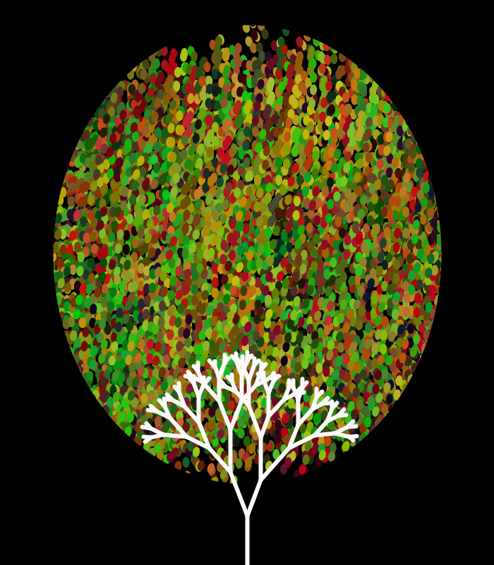
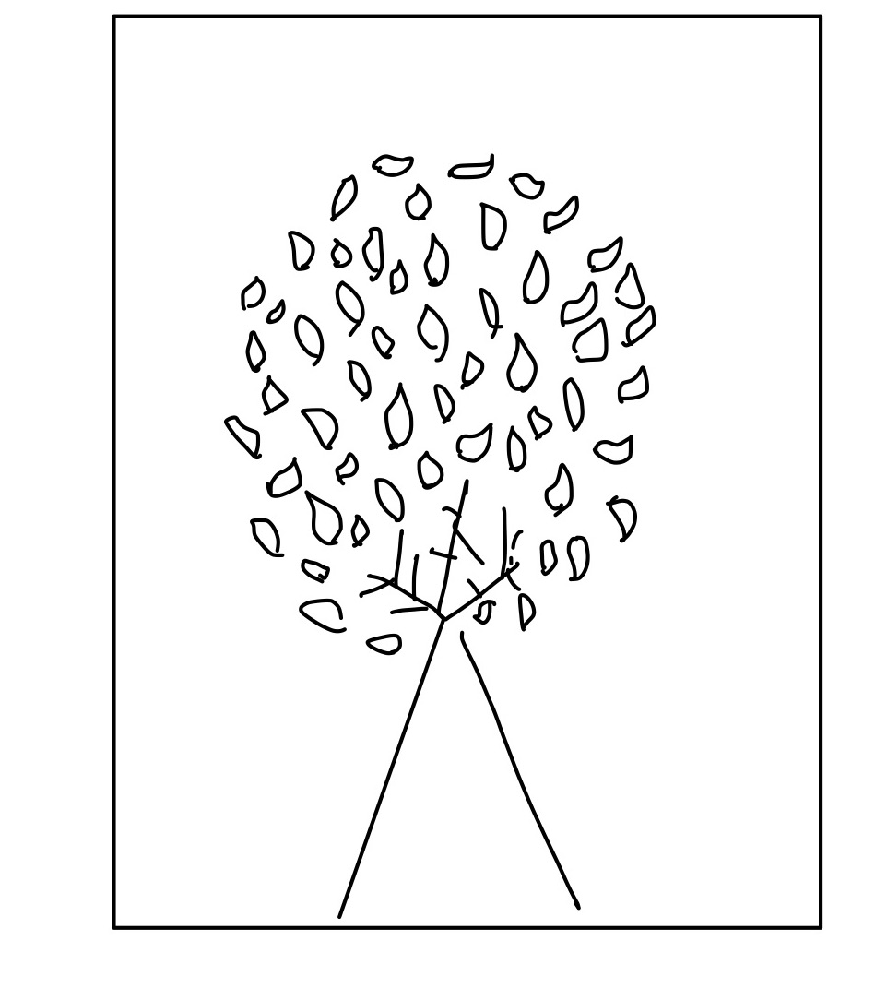
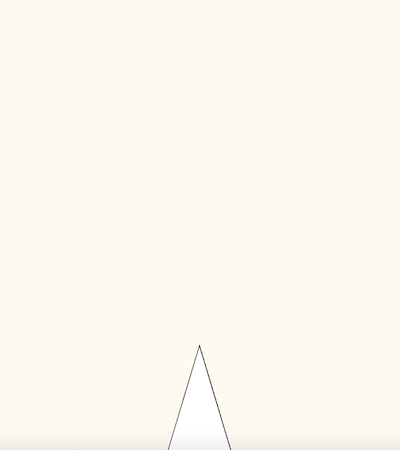
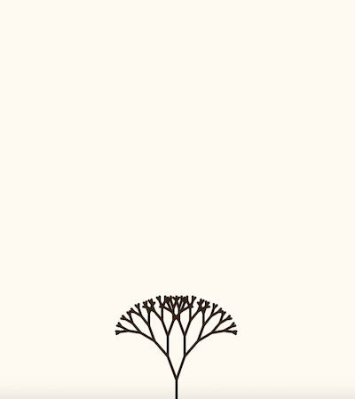
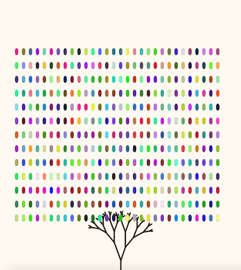
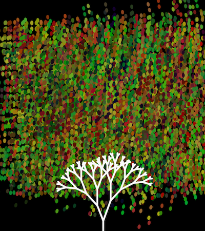

# Assignment 2:Processing Computer Graphic Artwork 

For this assignment 

Below is the final image of Soojin's Computer Graphic Art: 

## Process 

 

### Inspiration

## Evaluation & Reflection 

After learning how to animate on processing, I would like to make 

