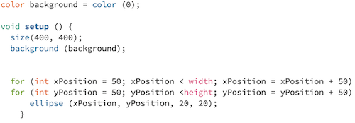

# Assignment 2:Processing Computer Graphic Artwork 

## Title: Pattern in Nature  

For week 2, I learnt loops (for() or while()) in processing. In nutshell, structured in three parts - *init, test, and update* - loops operates *init* and continues until the *test* evaluates to false. Since it is a sequence of repetition, when a loop is executed, it creates a pattern. Using this loops function, and incorporating if() syntax, I created a computer graphic artwork of a tree with colorful leaves and aesthetically designed branch.

The idea stemmed from myself wanting to capture the beauty of nature in the graphic world. I always thought patterns in the nature, and visible regulairties of form found in the natural world extremely fascinating. Therefore, since the scope of this project was to incorporate *loops* function that creates pattern, I wanted to model the beauty of nature in digital domain. It was especially interesting to work on this project because I often consider computer graphic work as an antonym of natural world. However this project proved me how they are not necessarily a black or white binary concept but instead, it showed how everything is interrelated and reminded me that afterall, every man-made object originates from the natural principles. 

**Below is the final image of my Computer Graphic Art:**

## Process & Challenges

### 1. Sketch tree using simple shapes 

 

### 2. Trunk and Branches (Fractal Tree)
                       

Originally, I planned to separate trunk from branches. So I started by drawing triangle shape for the trunk. However, to manually position branches on the trunk was a tedious process. Therefore, I decided to incorporate loops (for() or while()) to make this process less tedious. Referencing the example from the website https://www.rosettacode.org/wiki/Fractal_tree#Processing, I applid fractal tree principle to draw branch with a beautifully symmetrical pattern. Since it is a exponential growth, small changes in angle, or scale made a huge difference in shape. 

### 3. Leaves Pattern 

I wanted to make an artistic representation of matple leaves by drawing patterns of dots with different colors. 

In order to do this, I experimented positioning dots in certain distance apart to each another using loops (for() or while ()).

As I wanted to continuously genearate dots for both column and row, I gave both heigh and width an *int* and command to increase 50px. Which gave me an image below:

instead of executing  continuously generating dots over rows and columns, it executed both loops at simultaneously that 

It took me a while to figure out how to write a code that generates. This was because I was executing two commands within one while(). 

It was challenging for me to learn how to use loops (while() or for()) that applies for both x and y axies. When  It took me a lot of time to learn how to continuously run (for ()) for x axies and y axies. Instead of filling. it was making a diagonal line, when what I wanted to continuously draw both rows and . 
Creating leaves were the biggest challenge for me. Using Therefore, when I gave separate loops(for()) for xPosition and yPosition, it generated the intended shape I wanted to create. 

### 4. Randomize colors

I randomize colors 

### 5. Rotation & Organize layering order 

One issue was layering. I reordered 

Color: Using I was able to 

### 6. Masking 

## Evaluation & Reflection 

Although it seemed simple on the surface, I have faced so many challenges working on this project hence I had to adjust the scope of project. Originally, I wanted to create and using if(mouseclick); function, and using translate(x,y), I planned to animate the leaves falling and instaed animate snow falling. However, since I have not learnt how to animate and due to the scope of this project, I created static image of tree with colorful leaves. In future, I would like to learn how to animate on processing, come back to this project and animation to this artwork. 

