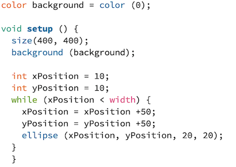
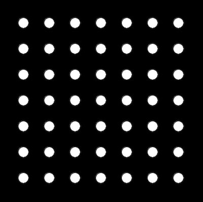

# Assignment 2:Processing Computer Graphic Artwork 

## Title: Patterns in Nature  

For week 2, I learnt loops (for() or while()) in processing. In nutshell, structured in three parts - *init, test, and update* - loops operates *init* and continues until the *test* evaluates to false. Since it is a sequence of repetition, when a loop is executed, it creates a pattern. Using this loops function, and incorporating if() syntax, I created a computer graphic artwork of a tree with colorful leaves and aesthetically designed branch.

The idea stemmed from myself wanting to capture the beauty of nature in the graphic world. I always thought patterns in the nature, and visible regulairties of form found in the natural world extremely fascinating. Therefore, since the scope of this project was to incorporate *loops* function that creates pattern, I wanted to model the beauty of nature in digital domain. It was especially interesting to work on this project because I often consider computer graphic work as an antonym of natural world. However this project proved me how they are not mutualy exclusive but instead, it showed how everything is interrelated and reminded me that afterall, every man-made object originates from the natural principles. 

**Below is the final image of my Computer Graphic Art:**

## Process & Challenges

### 1. Sketch tree using simple shapes 

 

### 2. Trunk and Branches (Fractal Tree)
                       

Originally, I planned to separate the trunk from its branches. So I started by drawing triangle shape for the trunk. However, to manually position branches on the trunk one by one was a tedious process. Therefore, I decided to incorporate loops (for() or while()) to make this process easier. Referencing the example from the website https://www.rosettacode.org/wiki/Fractal_tree#Processing, I applid fractal tree principle to draw branches composed of beautifully symmetrical pattern. 

### 3. Leaves Pattern 

I wanted to make an artistic representation of matple leaves by drawing patterns of dots with different colors. In order to do this, I experimented positioning dots in tables using loops (for() or while ()).

During class, we learnt how to continuosly generate shapes in row by looping xPosition + (trnaslation). As I wanted to continuously genearate dots for both column and row, I made xPosition and yPosition as variables, and looped to increase by 50px. Which gave me an image below:

Instead of continuously generating dots for rows and columns, since I put xPosition and yPosition under one loop(while()) x,y translation were executed simultaneously that it made a diagonal shape. 

It took me a while to figure out how to write a code that can continuously generate dots for rows and columns as seen in the image below: 

The key was to give separate loops(for() or while()) for for each variable xPosition and yPosition. 

### 4. Randomize colors

To illustrate a colorful leaves, I put randomized color by setting RGB vallue random. One challenge at this stage was layering. I wanted branch to be positioned in front of the leaves. To solve this issue, I separated leaves and branches to separate void and set the void setup to draws leaves first and branch at the last. 

### 5. Rotation & Organize layering order 

(Rotation)
To fill the tree area with abundant leaves and make it look more organic, I repeated the pattern with random rotation and translation. I have added pushMatrix() and popMatrix() to make sure the rotation does not affect other drawings. 

(Layering)
Since I have reorganized the order of drawing, branch is now layered in front of the leaves.

### 6. Masking 

To mask the pattern of leaves into the shape of tree was challenging. Initially, I attempted to use pShape function to customize the shape, rectangle with a ellipse hole, but drawing pShpae rectangle with ellipse was too complicated. Therefore, instead of drawing a pShape, I creatively made an ellipse with thick stroke without a fill, which gave the effect I wanted to have. 

## Evaluation & Reflection 

Understanding the concept of loops( while() and for() )  was fundamental for me to apply such function in creating an artwork. 

Although I have faced many small and big challenges throughout the process, I really enjoyed working on this artwork. I was fascinated by the potential of graphic processing in generating a beautiful artwork. Since I already had an idea on what image I want to represnet, the process for me was to write down a code that can translate the visual image in my mind to a code-generated image. Although I was successfully able to achieve this with some modifications, I think the reverse approach may be a better option since I can go wild and I may end up finding a code that goes beyong my thought and expectation.  

Originally, I wanted to create an animaion using if(mouseclick); function, to animate the leaves falling off and animate-in snow falling. However, since I have not learnt how to animate, and due to the scope of this project, I end up creating a static image of tree with colorful leaves. In future, I would like to learn how to animate on processing, come back to this project and animation to this artwork. 

