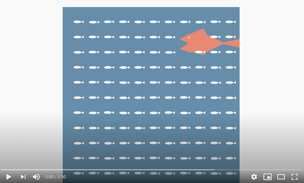
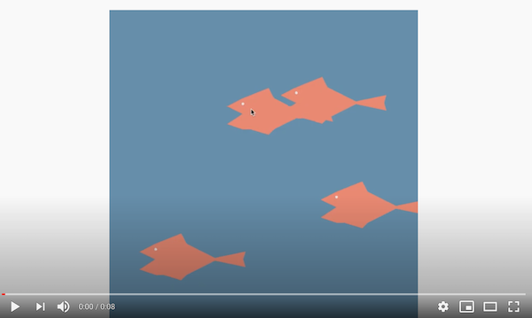
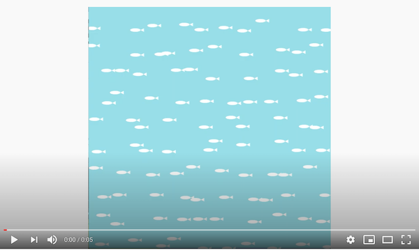
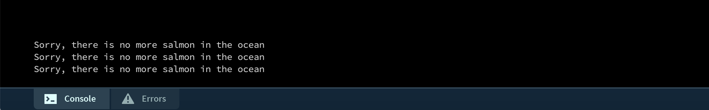
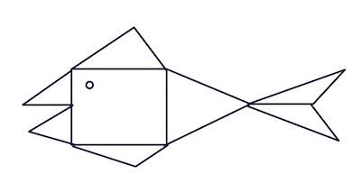

# Assignment 3:Object Oriented Programming

## Title: Foodchain underwater

My favorite fish is Salmon but I came across the news article ever since then, I can not think about . I wanted to create a. I wanted to create a light-hearted interactive animation that shows the foodchain underwater. 

Following to the instructions for this assignment to in corporate object-oriented programming, I created two classes, "fish", and "salmon",, This includes location, shape, movement and interactivity of two ocean creatures. 

Salmon eats fish and when the mouse is clicked, new Salmon appears. 

This is demonstrated in the video below: 

Users can not only create more Salmons but they can also catch Salmons by hovering mouse over the Salmon. 
I have demonstrated this when there is no fish left in the ocean in the video below:

(This is the verbal explanation of how this interactive animation works)
1. There is a school of fish in the ocean with a Salmon 
2. Fish and Salmon moves around and Salmon eats fish
3. Users can click mouse to add more Salmons (User can add up to 4 salmons max)
4. Salmons in the sea continuously move around and eat fish
5. Users can catch Salmon by hovering mouse on Salmon 

## Process

Before I start coding, I explored Java Examples preloaded in Processing and Daniel Shiffman's contributed examples

Designing Salmon 

I designed Salmon 

Coded everything based on the unit scale of Salmon body. 

When it reaches maximum, it notify how that there is no more Salmon in the ocean

## Challenges

**Class**
Instead of writing all I have separated tabs by classes. I have

Although it turned out to be really convenient and in the beginning having multiple tabs was confusing. 

**Orienting Fish**
I wanted fish to move around in its cells. Setting offset, x,y position along with 

**Draw Salmon**

It was especially challenging to 

**How to Erase Fish?**

I wanted Fish to disappear but I couldn't find 

**Color Random**
Originally I set color scale to random to have variety of fish in the ocean. However, instead of colors were changing every frame. I have tried. Therefore, I ended up having unified color; white. 

## Reflection/What's up next?
Working on this project, I built a solid understanding of array feature and classes in Processing. 
I want to make the animation more sophisticated by adding features such as moving Salmon's mouth, and make Salmon gets bigger as it eats fish. 
I also want to set a timer feature and turn this interactive animation into a game, where users have to catch all the fish within a time limit. 

