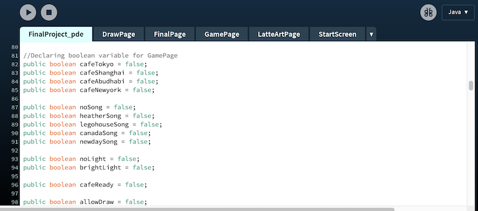
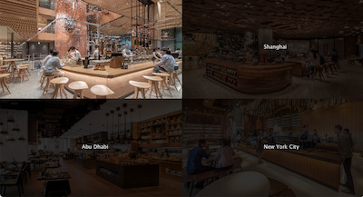
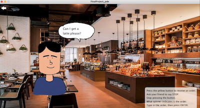
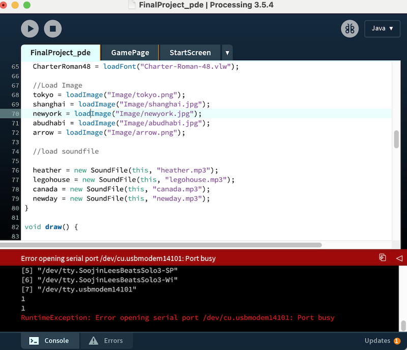

# Intro to IM Final Project: Dream Cafe!

## Inspiration


I love going to cafe. I love drinking coffee but apart from that I also love cafe for its vibe, its atmosphere, people I meet there, and the aesthetics of the cafe; it is the entire experience I get all-together. One of my bucket list is to have my own coffee shop. So for my final project, using Arduino and Processing, I decided to produce a fun, relaxing cafe game and make my dream come-true!!

## Description

"Dream Cafe" is a fun and relaxing game for those who want to have an experience of opening a cafe. By playing "Dream Cafe", you will be able to have a holistic experience of opening a cafe from choosing a locaiton, setting up the cafe environment, receiving orders, making latte art, and serving coffee to the customers. Please follow the instruction below to enjoy this game. 

### Instruction:

1) Choose a city where you want to open a cafe (on hover, that city will light up on the map!)

2) Turn on the light and set the music of your choice

- To turn on the light: Shed a light to the photoresister 
- To select a music: Dial the ORANGE potentiometer 

3) Once you set up the light and the music, customers will start to come. 

4) Press yellow button to receive an order (Press the button until your friend says "STOP").

5) Type-in the order that spinning wheel indicates and press ENTER
// 6) Start drawing Latte Art and make coffee for the customer 
      //Dial PINK potentiometer to adjust the brush stroke size
// 7) Once you finish making coffee, press READY to serve the coffee to the customer. 
// 8) Press RESTART to restart the game!

## Schematic 

The schematic for this project is below. 


## Final Circuit

This is an original circuit without any ornaments on the board. It has two breadboards and a servo motor. One bread board has four LED lights and another bread board has 2 potentiometers, one yellow button, and one photoresistor. 


This is the final circuit with a world map attached to LED breadboard, and the spinner attached to the servo-motor.


## Game Demonstration Video 

Click below to see the end result of my final project!

[](https://youtu.be/8zPUVFaiePk)


## Demo GIF 

LED light on the map lights up according to your hover on the image 


Turn on the lamp to shed a light to the photoresistor and to light up the cafe


Drawing latte art and adjusting the brush size using potentiometer


Press the button to activate spinner 


## Challenges & Process

### Pass boolean from one class to another 

The game "Dream cafe" Processing file is composed of a multiple pages for the players to navigate through and a number of tasks for them to complete. So instead of cramming everything in one pde file, I made multiple tabs and organized the code in classes. 



In total, I have one main project file with five different class pages. 




Creating a new class tab was not a difficult part. However, I faced an issue when I tried to pass boolean from one tab to another. For example, initially, I declared the boolean variables like this in the StartScreen Tab

````
boolean overTokyo = false;
````
This is a boolean variable that identifies mouse over images. However, when I tried to bring this boolean at the main project file for mouseClicked() function, there was an error with a message that the boolean is not found. After some research, I found out that the boolean should be declared as a "public" to be able to pass over the different tabs, and the boolean that is declared on the main project file is read by other tabs. Therefore, when declaring boolean, I used public boolean like this

````
public boolean overTokyo = false;
````
and to be extra safe, I started to declare all the booleans on the main project file. 

### Processing - Arduino Communication

Once I started to put Arduino and Processing in communication, I found out that for my previous project, I didn't make the handshake between Processing and Aruino. So to learn how to make a proper handshake was a challenge. 


````
 if (firstContact == false) {
      if (val.equals("A")) {
        myPort.clear();
        firstContact = true;
        myPort.write("A");
        println("contact");
      }
    } else { //if we've already established contact, keep getting and parsing data

      println(val); //receiving data
````

I struggled stopping Arduino to send "A" to Processing when the first contact is completed. I enabled this by setting a boolean firstContact as false by default, and when the Processing reads the handshake value "A", it clears the port and changes the firstContact to be true. This way, once there is a first contact, Processing can read data values needed to run the program and start sending the data to Arudino. 


### reset() Impossible




For my midterm project that is based on Processing only, to reStart the game,  added the reset function to enable players to reStart the game. 

I simply had to write rese();

Unlike previous project, for this project, where it only used Processing or Arduino, 


### Weak accuracy of the potentiometer value 

The accuracy of potentiometer was not great. Although I dial the potentiometer to the far right, the furthest I can go, it was only reading a value between 950-980. Hypothetically, the value should be 1023 when I turn the potentiometer to the furthest. In the beginning when I set the 4th song to be the value between 1023, the song was not being played because the value was not reached. Although I turn the 

### Allow Drawing by freezing Frame

Coding a "drawing" function was a challenge. Drawing a continuous line was not challenging, but to draw a continuous line on the background/images was difficult.With background color or an image, although the function void drawLatte() is correctly written and is executed, because the background is also continuously being drawn, the lines are not visible on the screen.

````
class LatteArtPage { 
  void displayLattePage() {
    background(255);
    fill(0);
    textSize(13);
    image(artlatte, 0, 0, 530, 650);

    text("To start drawing Latte Art, press the mouse.\nDial PINK potentiometer to adjust the brush size. \nOnce you have finished drawing, press READY to serve", 650, 575);
    if  (saved.equals (panda) == true) {
      image(pandaimg, 620, 40, 500, 500);
    } 
    if  (saved.equals (leaves) == true) {
      image(leaveimg, 620, 40, 500, 500);
    }
    if  (saved.equals (sun) == true) {
      image(sunimg, 620, 40, 500, 500);
    }
    noStroke();
    rect(1070,570,100,40, 10);
    fill(255);
    textSize(18);
    text("READY",1095, 595);
  }
  
    void drawLatte(){
   // Paint & draw with Blue Brush by pressing the mouse
    strokeWeight (brushSize);
    stroke(221,138, 60);

    if ((mousePressed == true) && (allowDraw)) {
      line(mouseX, mouseY, pmouseX, pmouseY);
    }
  }
}
````


First solution that came to my mind was obviously to get rid of the background. However, the issue was that when there is no background, I can draw continouous line on the page but the images from the previous page, the GamePage, is visible underneath. Therefore, I had to find another solution. 

But this trouble give me a source of inspiration. Turning this trouble, the fact that the previous page is shown underneath, into my own advantage, I found the solution. Basically, I separated drawing page into two separate pages; one page that contains the background and images needed for this latte art; the LatteArtPage and another page that only contains the funciton of drawing the continuous line, the Draw Page. So once the drawing starts, the LatteArtPage is displayed and with 2 milliseconds of delay, 

````
 if (keyCode == ENTER) { // confirm the order and start doing the latte art
    Draw_Page = true;
    delay(2);
    latte_page = true;
````

it moves to DrawPage. This allows players to draw on the transparent backgorund with the previous page, the exact page that is intended for the latte art. 

## Process & Journal

To Read the process of making this Dream Cafe with a day by day progress, challenges, and iterations,

please visit [link to section](https://github.com/Soojin-Lee0819/IntrotoIM/blob/main/Final%20Project/journal.md)

## Interesting Findings 

- Consistency is the Key!! Somedays you don't make less progress than the other day. But don't get frustrated and continue working everyday. When you look back, you have made so much progress already. 

- Schematic does not tell you how to build the breadboard. This was my first time using more than breadboard for a project. When I was using only one breadboard, it was not necesarry to indicate how to build the circuit. However, since this project uses more than one breadboard, the image of the circuit was necessary for people to understand how this circuit is built. For example, if I build LED lights and potentiometer or photoresistor on the same breadboard, the players will face difficulty adjusting them because it will be covered by a map. 


## Evaluation 

Overall, I am very happy with the outcome of this project. From the beginning, I wanted to make an original and creative game that is different from the ones that are already available. This was difficult because unlike adapting the existing game that has a reference point I can follow, for this one, I had to come up with everything from the structure, the organization, and the coding part of the game. Therefore, knowing that this project will take a lot of time, I started to work on this project earlier than what was expected. As I started early, I was able to finish early as well. I am proud that I was able to get the project done much early on time so that I don't have to rush. Instead, I was able to take enough time to improve on the designs, aesthetics, details and documentation of the process. I tried to add many interactive features for this project; the communication  between Processing and Arduino, between Processing and the player, and between Arduino and the player. 

## How I can Improve?

For every project, I have a growth and development but also I always end up finding something that I want to try for the future project. One thing that I want to for my next project is that I want to make a game that allows multiple players. I want to create a game that allows people to play together, have fun and make cute memories. Another thing is I wonder if I can make the coding more efficient. I want to write a code that will improve the data processing and make the loading faster. I found out that the data processing of this game was very slow. It not only takes a long time to load the game, but on the mouseClick as well. This was an expected result because when I was writing a code for this project, I didn't consider the efficiency of the code at all. I would like to know if it is possible to write a code that will fasten the loading/reaction speed, and if so, I want to learn how to write such a code. 
 

## Sources & Credit 

### Songs
Songs that I used for this project:

1) Heather by Conan Gray (https://www.youtube.com/watch?v=GPUg7n8-M6o)

2) Canada by Lauv (https://www.youtube.com/watch?v=hb_p3bKrK84)

3) Lego House by Ed Sheeran (https://www.youtube.com/watch?v=c4BLVznuWnU)

4) New Day by Paul Kim (https://www.youtube.com/watch?v=hGFKxgpa3fc)


### Images

Images I used for this project:

Starbucks image Shanghai / Starbucks image Tokyo / Starbucks New York City (https://www.starbucksreserve.com/en-us/visit)

Cafe 302 Abu Dhabi img (https://www.zomato.com/abudhabi/cafe-302-al-maha-arjaan-by-rotana-al-markaziya)

Customer img (https://pixabay.com/it/illustrations/viso-uomo-cartone-animato-umano-4005302/)

Latte art hand close up img (https://computerbackgroundimages.com/)

Latte art coffe img (https://www.vectorstock.com/royalty-free-vector/latte-art-set-vector-20772198)


