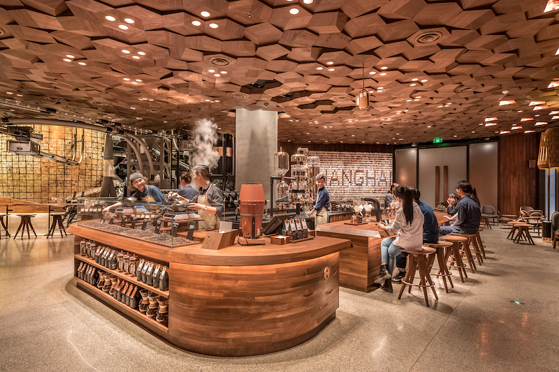
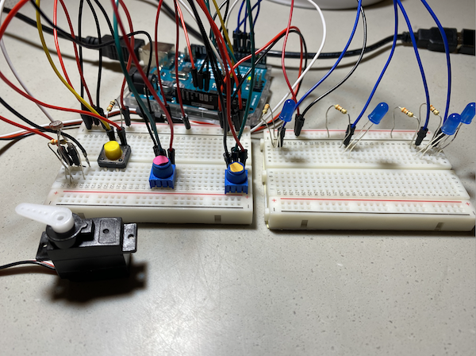
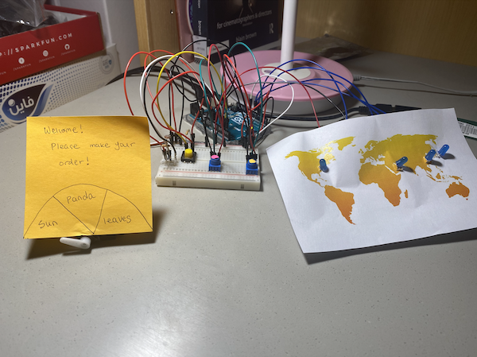
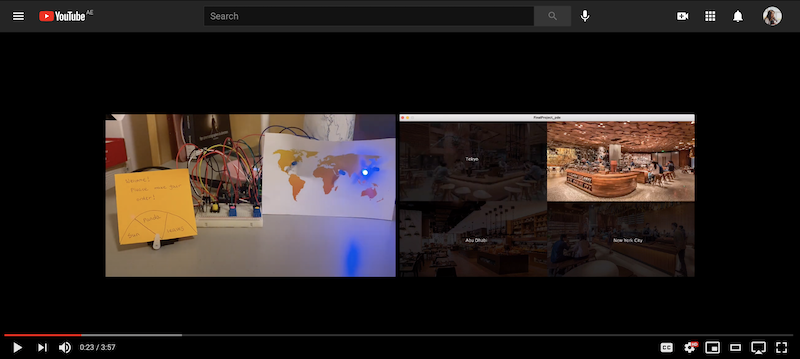

# Intro to IM Final Project: Dream Cafe!

## Inspiration

I love going to cafe. I love drinking coffee, eating cakes, but apart from that I also love cafe for its vibe, its atmosphere, the people in it, and the aesthetics; it is the whole experience I get all-together. One of my bucket list is to own a coffee shop. So for my final project, using Arduino and Processing, I decided to produce a fun, relaxing cafe game and make my dream come-true!!

## Description

"Dream Cafe" is a fun and relaxing game for those who want to have an experience of opening a cafe. By playing "Dream Cafe", you will be able to have a holistic experience of opening a cafe from choosing a locaiton, setting up the cafe environment, receiving orders, making latte art, and serving coffee to the customers. Please follow the instruction below carefully to enjoy this game. 

### Instruction:

1) Choose a city where you want to open a cafe (On hover, the city will light up on the map!)

2) Turn on the light and set the music of your choice

- To turn on the light: Shed a light to the photoresister 
- To select a music: Dial the ORANGE potentiometer 

3) Once you set up the light and the music, customers will start to come. 

4) Press yellow button to receive an order. (Press the button until your friend says "STOP")

5) Type in the order that the spinning wheel indicates and press ENTER
// 6) Start drawing Latte Art and make coffee for the customer 
      //Dial PINK potentiometer to adjust the brush stroke size
// 7) Once you finish making coffee, press READY to serve the coffee to the customer. 
// 8) Press RESTART to restart the game!

## Schematic 

The schematic of this idea is below. One thing to be careful is that it uses two bread boards. All the lights goes to one bread board and the rest goes to the other bread board. 

## Final Circuit

This is an original circuit without any ornaments on the board. It has two breadboards and a servo motor. One bread board has four LED lights and another bread board has 2 potentiometers, one yellow button and one one photoresistor. 

This is the final circuit with a world map and the spinner attached.

## Game Demonstration Video 

Click below to see the end result of my final project!

## Demo GIF 

Below is the quick look of map that lights up according to your hover

Below is the quick look of turning the lamp on to shed a light to the photoresistor and to light up the cafe

Below is the quick look of drawing latte art and adjusting the brush size using potentiometer

Below is the quick look of pressing button to activate spinner 

## Challenges & Process

### Override boolean across the Classes

### reset() Impossible

### LED light not bright enough 

### Weak accuracy of the potentiometer value 

### Allow Drawing by freezing Frame

### Processing - Arduino Communication

Once I started this project, I found out that 

## Sources & Credit 

### Songs
Songs that I used for this project:

1) Heather by Conan Gray (https://www.youtube.com/watch?v=GPUg7n8-M6o)

2) Canada by Lauv (https://www.youtube.com/watch?v=hb_p3bKrK84)

3) Lego House by Ed Sheeran (https://www.youtube.com/watch?v=c4BLVznuWnU)

4) New Day by Paul Kim (https://www.youtube.com/watch?v=hGFKxgpa3fc)

### Images

Images I used for this project:

Starbucks image Shanghai / Starbucks image Tokyo / Starbucks New York City (https://www.starbucksreserve.com/en-us/visit)

Cafe 302 Abu Dhabi img (https://www.zomato.com/abudhabi/cafe-302-al-maha-arjaan-by-rotana-al-markaziya)

Customer img (https://pixabay.com/it/illustrations/viso-uomo-cartone-animato-umano-4005302/)

Latte art hand close up img (https://computerbackgroundimages.com/)

Latte art coffe img (https://www.vectorstock.com/royalty-free-vector/latte-art-set-vector-20772198)

