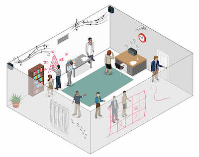

# Final Project Journal

## 13 April 2021

### Preliminary concept for my final project 

For my final project I plan to create an Escape Room using Arduino and Processing.

Escape room is an experience of an adventure storeis where the players are locked in the room, and they have to reveal clues, and complete certain tasks in order to unlok the door to freedom. I chose this as my final project because the project by nature allows me to incorporate different execises that I have done so far throughout the semester and I can be really creative with the clues and the tasks.

Usually, escape rooms are done in but in admist of this global pandemic, being confined in a room with a group of people are limited, I wanted to develop a home version of Escape room where you can experience the thrill and joy that you get from the escape room at your home. 

For now, considering the scope of this project, I envision this game to involve 34-5 different quests/challenges/tasks. Each task will involve some sort of communication between arduino and processing and I plan to make it very creative and engaging.

Here are some of the challenges that I have in mind as of now.

Drawing Challenge: 

