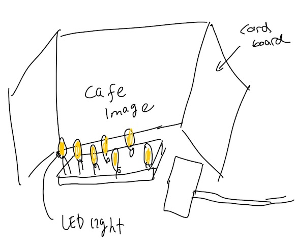

# Final Project Journal

### SHORTCUTS
[Day 1](journal.md#day-1), [Day 2](journal.md#day-2), [Day 3](journal.md#day-3), [Day 4](journal.md#day-4), [Day 5](journal.md#day-5), [Day 6](journal.md#day-6), [Day 7](journal.md#day-7), [Day 8](journal.md#day-8), [Day 9](journal.md#day-9), [Day 10](journal.md#day-10)

## JOURNAL ENTRIES

## 13 April 2021
##### day-1

### Developing preliminary concept 

For my final project, using Arduino and Processing, I want to produce a fun and relaxing cafe game.

This is not a competitive game. It will be a chill relaxing game where you follow the instructions and enjoy completing certain tasks. For now, considering the scope of this project, I plan to have 4-5 different challenges/tasks. Each task will involve the use of arduino, processing or both. I plan to make it very creative and engaging.

Here are some of the challenges that I have in mind as of now.

## Task Ideas

### Setting up light 

Setting a cozy, welcoming, and comfortable environment for cafe is a key. Players will be given an image of the lighting of the cafe with some clues. Then it is their task to find a way to adjust the lighting of the cafe and set up a light in a way that matches the image. Photoresistor and LED lights will be needed for this challenge.

  

### Set a Cafe Music

Another importnat aspect a cafe is its "music" choice. For this section, players can use potentiometer to choose the background music of the cafe.

### Getting Order

I plan to add a pin to the servo motor and make a spinning wheel with a list of request from the customers for the latte art. Servo motor will spin and whatever it stops on will be the task for the next challenge. 

  

### Latte Art

Based on the sketch design (order) that was chosen by previous challenge, you need to draw a latte art. You will use a mouseclick and buttons for this challenge. 

  

### Motor
I want to incorporate motor for my final project but as of now I didn't learn how to use motor. After learning how to use motor on Thursday, if applicable, I may add one more challenge that incorporates motor. 

## 14 April 2021
##### day-2

### Designing landing page for Processing 

I started on this projecct early becasue I did notwant to rush through the project. I started with desinging a landing page on Processing. For the landing page, I wanted players to be able to choose where they are going to open up a cafe and view it on the map. I carefully chose the images of cafes around the world that has a good resolution. When choosing cafe images, it was difficult to ignore my "perfectionist" mindset. I have spent around 2 hours choosing "perfect" images when the logical part of my brain was telling me that I should be spending more time first getting the technical parts done, and work on the details if I have more time. 

There were two things that I wanted this page to do.

First, when the player hover the mouse on the image,the opacity of the image changes and reveals how the cafe looks. Another thing is when the image is clicked, I wanted that clicked image to be the background image of the next page. 

Initially, I just assigned mouse to track and change the opacity of the image when the mouse is hovered on that image. This worked for the first part, but when I tried to implement the second part, since there is no data recorded to make what image should be on the background, it was tricky. Therefore, I redid the 

I have set each image as boolean because it not only

## 15 April 2021
##### day-3

### Arduino-Processing handshake 

I realized that for my previous project, I was able to successfully connect Arduino to Processing but without a handshake. Since I 

## 16 April 2021
##### day-4

### Lighting up map 

## 17 April 2021
##### day-5

## 18 April 2021
##### day-6

## 19 April 2021
##### day-7

## 20 April 2021
##### day-8

## 21 April 2021
##### day-9

Installing ornaments to arduino. I added a map and the spinning wheel to the arduino. 

Positioning lights to the map was challenging. I had to crook the legs of the LED lights to adjust the angle and the position of the light. 

 .

I made the final page on processing. 

## 22 April 2021
##### day-10

Hurrah! I finished the project much earlier than the deadline! I was able to finish it this early because I started working on it much earlier. Today, I worked on finalizing journaling and the documentation. Today, I filmmed the demo video, uploaded it to the YouTube and wrote down the challenges/process. 

What do I want to change? 

For my next project, I want to 

