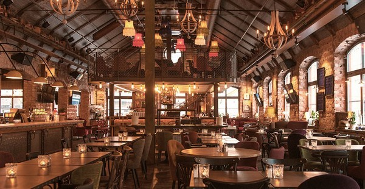

# Final Project Journal

### Shortcuts
[Day 1](journal.md#day-1), [Day 2](journal.md#day-2), [Day 3](journal.md#day-3), [Day 4](journal.md#day-4), [Day 5](journal.md#day-5), [Day 6](journal.md#day-6), [Day 7](journal.md#day-7), [Day 8](journal.md#day-8), [Day 9](journal.md#day-9), [Day 10](journal.md#day-10)

## JOURNAL ENTRIES

## 13 April 2021
##### day-1

### Developing Concept 

For my final project, using Arduino and Processing, I want to produce a fun and relaxing cafe game.


This is not a competitive game. It will be a chill and relaxing game where you follow the instructions and enjoy completing certain tasks. For now, considering the scope of this project, I plan to have 4-5 different challenges/tasks. Each task will involve the use of arduino, processing or both. I plan to make it very creative and engaging.

Here are some of the challenges that I have in mind as of now.

## Task Ideas

### Setting up light 

Setting a cozy, welcoming, and comfortable environment for cafe is a key. Players will be given an image of the lighting of the cafe with some clues. Then it is their task to find a way to adjust the lighting of the cafe and set up a light in a way that matches the image. Photoresistor and LED lights will be needed for this challenge.

  

### Set a Cafe Music

Another importnat aspect a cafe is its "music" choice. For this section, players can use potentiometer to choose the background music of the cafe.

### Getting Order

I plan to add a pin to the servo motor and make a spinning wheel with a list of request from the customers for the latte art. Servo motor will spin and whatever it stops on will be the task for the next challenge. 

  

### Latte Art

Based on the sketch design (order) that was chosen by previous challenge, you need to draw a latte art. You will use a mouseclick and buttons for this challenge. 

  

### Motor
I want to incorporate motor for my final project but as of now I didn't learn how to use motor. After learning how to use motor on Thursday, if applicable, I may add one more challenge that incorporates motor. 

## 14 April 2021
##### day-2

### Designing landing page for Processing 

I started with desinging landing_page on Processing. For the landing_page, I wanted players to be able to choose where they want to open up a cafe, and have it viewed on the map by having Arduino LED lights to light up. I carefully chose the images of cafes around the world with a good resolution. When choosing cafe images, it was difficult to ignore my "perfectionist" mindset. I spent around 2 hours choosing the "perfect" images when the logical part of me was telling me that I should be spending more time getting the technical parts done, and work on the details later if I have more time. 


I focused on two functions:

First, when the player hover mouse on the image,the opacity of the image changes; revealing the cafe. 

Second, when the image is clicked, the clicked image will be the background of the next page, the GamePage. 

Initially, for the class StartScreen, I just simply assigned to track the mouse and wrote a code for it to change the opacity of the image when the mouse is hovered on the image. With this, changing the opacity of the image was not an issue, but since there is no data recorded regarding which image is clicked on, I couldn't execute the second part; to set a clicked image to be the background image of the GamePage. 

Therefore, I redid the first part and set each image as a boolean. 

````
boolean shanghaiOver (int x, int y, int width, int height) {
    if (mouseX >= x && mouseX <= x+width && 
      mouseY >= y && mouseY <= y+height) {
      return true;
    } else {
      return false;
    }
  }
````
and set the function; when the mouse is hovered on the image, it makes the boolean true. For instance, when I have my mouse hover on the parameter of Shanghai cafe image, 

````
void update(int x, int y) {
    if ( shanghaiOver (ShanghaiX, ShanghaiY, imageWidth, imageHeight)) {
      overShanghai = true;
  ````
  it returns the overShanghai TRUE
  
And on the main project page, I set for the function mouseClick(), when the mouse is clicked when overShanghai is ture, it turns the boolean cafeShanghai TRUE;
  
  ````
   if (start_screen  && overShanghai ) { // when click Shanghai
    game_page = true;
    cafeReady = false;
    start_screen = false;
    cafeShanghai = true;
  } else {
    cafeShanghai = false;
  }
  ````

which allows me to create a channel of communication where the click of certain image leads to having that image to be the background of the following page. 

## 18 April 2021
##### day-3

### Arduino-Processing handshake 

Today my goal was to connect Aruino, Processing and make the LED light up when the mouse is hovered on the image. I referenced the code that I used for my previous project "Draw Korean Flag" to initiate the contact between Processing and Aruino. I realized that for my previous project, I did make a communication between Arduino and Processing but without a handshake. For this time, I made sure I make a proper handshake before I put the two programs in communication. 


````
 if (firstContact == false) {
      if (val.equals("A")) {
        myPort.clear();
        firstContact = true;
        myPort.write("A");
        println("contact");
      }
    } else { //if we've already established contact, keep getting and parsing data

      println(val); //receiving data
````

I struggled making Arduino to stop sending "A" when the first contact is completed. I enabled this by setting a boolean firstContact as false by default and when the Processing reads the handshake value "A", it clears the port and changes the firstContact to be true. This way, once the first contact is complete, they can read data values needed to run the program. 


## 19 April 2021
##### day-4

### Lighting up map 

I set up the Arduino circuit with four blue LED lights and coded Processing to send the number value when the mouse is hovered on the specific image (for example Shanghai), 

**Processing**
````
 if (overShanghai) {
      myPort.write('1');
      image(shanghai, 600, 0, width/2, height/2);
    } else {
      myPort.write ('0');
    }
````

and coded Arduino to turn on the LED light when it reads those assigned values;

**Arduino**

````
 if (val == '1') { //tokyo light on
      digitalWrite(shanghaiLEDPin , HIGH);
    } else {
      digitalWrite(shanghaiLEDPin , LOW);
    }
   
    if (val == '0') { //no light on
      digitalWrite(tokyoLEDPin , LOW);
      digitalWrite(shanghaiLEDPin , LOW);
      digitalWrite(newyorkLEDPin , LOW);
      digitalWrite(abudhabiLEDPin , LOW);
    }
````


and if the mouse is not hovered on the images, the Processing sends the value (0), and when the Arduino receives the value '0' it digitalWrites all the pins to be LOW; turning off all the lights.

I was surprised to find out how fast the interaction between Processing and Arduino could be. When I moved the mouse from one image to another, the Arduino light changed immediately without a delay. 

## 20 April 2021
##### day-5

I started to develop the tasks for the GamePage. I made two tasks. First, the player has to shed the light to the photoresistor to make the cafe brighter and second, dial the potentiometer to choose the right song for the cafe. Only when the player has successfully set up the light and the sound for the cafe, he/she can proceed to the next part of the game.

### Designing & Building Game Page

I first designed the Game_page. The default design of the Game_page is the image on the left; a dark cafe with an instruction on how to set up the light and the music. Once the player successfully complete the given tasks, they meet a new page with a customer and a new instruction

  


### Set up Photoresistor as a tool to adjust the lighting of the cafe

I built the photoresistor to Arduino circuit and mapped the reading of its value between 0-2

````
  //read the value of the photoresistor (ANALOG)
  int photoValue = analogRead (photoresistorPin);
  byte chooseLighting = map(photoValue, 0, 1023, 0, 2);

````
These values are then sent to the Processing.

Processing receives these values. When it receives 0, it makes the boolean noLight TRUE, and when it receives 1 or 2, it makes the boolean brightLight true. 
When noLight is true, the opacity of cafe image is set to tint (255,50), which makes the cafe dark. When brightLight is true, the opacity of the image is set to full opacity tint(255, 255), which makes the cafe bright. 


````
  if ((int)(values[1]) == 0) {
          noLight = true;
        } else {
          noLight = false;
        }
        if ((int)(values[1]) == 1 || (int)(values[1]) == 2) {
          brightLight = true;
        } else {
          brightLight = false;
        }
````

### Set cafe music using Potentiometer 

I selected four songs in total. I chose the songs that I enjoy listening to : 1. Heather 2. Canada 3. Lego House 4. NewDay

I built the potentiometer to Arduino circuit and mapped the readings of its value between 0-5.

````
 //read the value of the potentiometer for choosing music (ANALOG)
  int pmsensorValue = analogRead (potentiometerPin);
  byte chooseSong = map(pmsensorValue, 0, 1023, 0, 5);
````

Arduino sends the value, and Processing reads the value. 

Since both the potentiometer and photoresistor values are received simultaneously, I used a split to process the data by category.

````
  println(val); //receiving data
      int values [] = int(split(val, ',')); //split values by category
````

When the processing receives 0 or 5 from the potentiometer value, it plays noSong, and when it receives the the value between 1-4, it plays the corresponding song. 

I made the buffer value 0 and 5 so that when the potentiometer is not dialed, there is no song in the cafe. 

### When Sound and Light are set, Receive the order

````
   if ((int)(values[0]) == 0 || (int)(values[0]) ==5 && (int)(values[1]) == 0) {
          cafeReady = false;
        } else {
          cafeReady = true;
        }
 ````
 
 I made a boolean cafeReady. When the light and music are on, cafe is ready. If the cafe is ready, the GamePage will show the image of customer and another instruction for the players to follow. 

## 21 April 2021
##### day-6

### Installing Servomotor for order 

I continued working on the GamePage. I built the yellow button and the servo motor to the circuit. I plan to add the spinning wheel to the servo motor but for now, I focused on getting done with the funtional part. 

### Players Type-in the order

I added the feature where the players can type in order and having it appear on the screen. 

````
void keyPressed() {
  //Type in Order
  if (keyCode >= 65 && keyCode <= 90) {
    //keyCode >= 65 && keyCode <= 90 is all the alphabets 
    order = order + key;
  }

  if (key == BACKSPACE) { // allow deleting the input
    if (order.length() > 0) {
      order = order.substring(0, order.length()-1);
    }
  }
 ````
I even added the delete function to allow mistake. When they type a wrong letter, they can erase by pressing a BACKSPACE. I enabled this by using substring and order.length. 

 { // confirm the order and start doing the latte art
    latte_page = true;
    game_page = false;
````

the order is made, and it moves to the next section of the game; the latte_page. 

For today, I just made the arbitrary latte_page and ended the work here. 

## 22 April 2021
##### day-7

Picking up from yesterday, I started to work on the drawing latte art page. 

I wanted to provide players with a sketch to draw on; the outline of the panda, the sun, and the leaves as the bases of the latte art. Using Adobe Photoshop, I created a cup of coffee with the sketch and the transparent background. 


Once I made these outlined images, I wanted these images to pop-up according to the order the players have typed-in, in the previous page. For example, if the player typed "panda" and pressed enter, I wanted the outline sketch of "panda" to show up. 

To do this, I revisited the code for void KeyPressed()

````
void keyPressed() {
if (keyCode == ENTER) { // confirm the order and start doing the latte art
    Draw_Page = true;
    delay(2);
    latte_page = true;
    game_page = false;
    saved = order;
    order = "";
  }
  }
  ````
  
 To do this, I saved the order as a string, and for the latte_art page, I wrote a code that checks the "saved" and displays the image accordingly.
 If the player makes a mistake and types in a wrong order, no image will show. 
 
 ````
  if  (saved.equals (panda) == true) {
      image(pandaimg, 620, 40, 500, 500);
    } 
    if  (saved.equals (leaves) == true) {
      image(leaveimg, 620, 40, 500, 500);
    }
    if  (saved.equals (sun) == true) {
      image(sunimg, 620, 40, 500, 500);
    }
  ````
 
I will work on "drawing" function tomorrow. 

## 23 April 2021
##### day-8

Today my goal was to fix and complete the "Drawing_Page". I had to figure out how to draw continuous line on the background or the image. With background color or an image, although the function void drawLatte() is correctly written and is executed, because the background is also continuously being drawn, the lines are not visible on the screen.

````
class LatteArtPage { 
  void displayLattePage() {
    background(255);
    fill(0);
    textSize(13);
    image(artlatte, 0, 0, 530, 650);

    text("To start drawing Latte Art, press the mouse.\nDial PINK potentiometer to adjust the brush size. \nOnce you have finished drawing, press READY to serve", 650, 575);
    if  (saved.equals (panda) == true) {
      image(pandaimg, 620, 40, 500, 500);
    } 
    if  (saved.equals (leaves) == true) {
      image(leaveimg, 620, 40, 500, 500);
    }
    if  (saved.equals (sun) == true) {
      image(sunimg, 620, 40, 500, 500);
    }
    noStroke();
    rect(1070,570,100,40, 10);
    fill(255);
    textSize(18);
    text("READY",1095, 595);
  }
  
    void drawLatte(){
   // Paint & draw with Blue Brush by pressing the mouse
    strokeWeight (brushSize);
    stroke(221,138, 60);

    if ((mousePressed == true) && (allowDraw)) {
      line(mouseX, mouseY, pmouseX, pmouseY);
    }
  }
}
````


First solution that came to my mind was obviously to get rid of the background. However, the issue was that when there is no background, I can draw continouous line on the page but the images from the previous page, the GamePage, is visible underneath. Therefore, I had to find another solution. 

But this trouble give me a source of inspiration. Turning this trouble, the fact that the previous page is shown underneath, into my own advantage, I found the solution. Basically, I separated drawing page into two separate pages; one page that contains the background and images needed for this latte art; the LatteArtPage and another page that only contains the funciton of drawing the continuous line, the Draw Page. So once the drawing starts, the LatteArtPage is displayed and with 2 milliseconds of delay, 

````
 if (keyCode == ENTER) { // confirm the order and start doing the latte art
    Draw_Page = true;
    delay(2);
    latte_page = true;
````

it moves to DrawPage. This allows players to draw on the transparent backgorund with the previous page, the exact page that is intended for the latte art. 

[Adjusting Brush Stroke]

I also installed the second potentiometer to adjust the brush storke size. 

To use potentiometer to adjust the brush size, I mapped the value of the AnalogRead (0,1023) to (3,10) as I wanted the brush size to be between 3-10.

````
  int pmsensor2Value = analogRead (potentiometer2Pin);
  byte brushSize = map(pmsensor2Value, 0, 1023, 3, 10);
  ````

### Arduino

   //read the value of the potentiometer for brush stroke size(ANALOG)
  int pmsensor2Value = analogRead (potentiometer2Pin);
  byte brushSize = map(pmsensor2Value, 0, 1023, 3, 10);

### Processing 

if ((int)(values[2]) >2) {
          allowDraw = true;
          brushSize = float (values[2]);
        } else {
          allowDraw = false;
        }

I wanted the read value of the 2nd potentiometer to be directly assigned as a brushSize. I originally assigned the brushSize brushSize = int (values[2]); with an integer of the read value, which led to an error. I later found out that this is because the value should be read as a float


## 24 April 2021
##### day-9

Today I finally installed ornaments to the Arduino circuit. I added a map and the spinning wheel to the Arduino. I added these at the end when I was sure that everything is working well because once I install the ornaments, it is difficult to move the pins and the resistors around. 

When installing the map, positioning lights to the right position was challenging. I had to crook the legs of the LED lights to adjust the angle and the position of the light. 

 .

I made the final_page on processing.


 I used saved data (what was typed for the order, String order="") to have the image appear on the screen as a final result. To do this, I had to add an extra String, String saved=""; that saves what was typed until the player hits the ENTER button and store it as a data.

````
   if (keyCode == ENTER) { // confirm the order and start making the order
    Draw_Page = true;
    delay(2);
    latte_page = true;
    game_page = false;
    saved = order;
    order = "";
  }
````

For instances, if the order was Panda, and the player typed in "panda", for the final page, the completed latte art of panda will appear on the screen.
 
 ````
 
     if  (saved.equals (panda) == true) {
      image(pandacoffeeimg, 620, 65, 500, 500);
    } 
    if  (saved.equals (leaves) == true) {
      image(leavecoffeeimg, 620, 65, 500, 500);
    }
    if  (saved.equals (sun) == true) {
      image(suncoffeeimg, 620, 65, 500, 500);
    }
 
 ````
 
 I added RESTART button to allow players to replay. When I had the RESTART button positioned at the same location as the READY button on the draw_page, when I click READY button, although I coded like this
 
  ````
   if (Draw_Page && mouseX >1070 && mouseX < 1170 && mouseY > 570 && mouseY < 610 ) { // return to Start Screen
    Final_Page = true;
    Draw_Page = false;
  } 

  if (Final_Page && mouseX >1070 && mouseX < 1170 && mouseY > 570 && mouseY < 610 ) { // return to Start Screen
    Final_Page = false;
    start_screen = true;
    
  }
  ````
  
  
  
  for some reason, when I clicked READY on the Draw_Page, it did not move from the Draw_Page to the Final_Page, but instead it automatically moved to the start_screen.
  
  To solve this issue, I repositioned RESTART button to top right corner so the button positions do not coincide. 
  

## 25 April 2021
##### day-10

Hurrah! I finished the project much earlier than the deadline! I was able to finish it much early because I started early. One big take away from working on coding projects is the importance of consistency and time management. Somedays I get stuck and I only make a small progress. However, when I work consistently, these small progresses pile up, and eventually when I look back, I have made a big progress. For today, I worked on finalizing journaling and the documentation. Today, I filmmed the demo video and uploaded it to the YouTube.

I also drew the schematic. 


I wonder if I need to specify that I used two breadboards on the schematic. If so, how do I show? I asked on the discord regarding this question.


## 26 April 2021
##### day-11

As I thought, the professor replied me that it is not necessary to specify using two breadboards on the schematic because schematic doesn't show the breadboard at all. The schematic only shows 

1) which components I've used and
2) the conncections between the components.

Nothing about how those connections are made belong in the schematic. 

So I did not have to make any changes on my shematics! 
