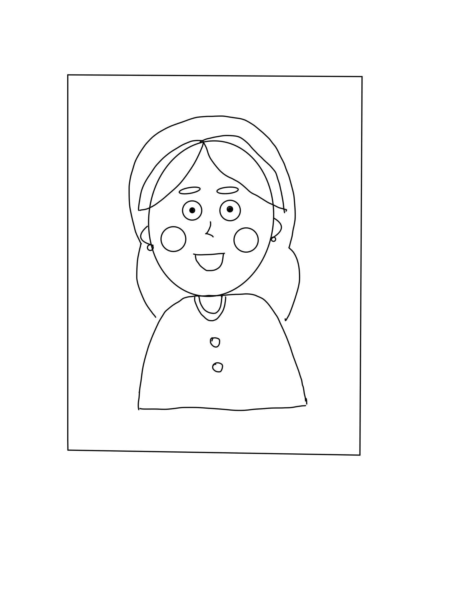

# Assignment 1:Processing Self Portrait 

## Project Description
This project is a self-portrait drawn entirely by code using basic drawing functions in Processing. I used simple shapes to create a cartoon-like self-portrait. Since this is my first project using Processing, the main focus was on understanding the principles of coding. Since I mainly used simple shapes such as circle, ellipse, rectangle, and strokes, instead of making a realistic representation of myself, I focused on capturing the character and personality of myself in the portrait. The scope of this project was to create a non-dynamic static image. However, as I was exploing different features on processing, I added some dynamic animation features like changing colors, moving eyebrows, and enlarging blush to make it more engaging for the viewers. 

Below is the image of my final self portrait:

and this is the animated version of my portrait:

## Process 

### *1. Brainstorm & Limitation on variety of shapes I can code*

After class, I was so excited to try out things that I learnt in the class that I started to code directly on Processing Program. Since this was my first time drawing by code, it was not easy for me to visualize or translate image to code simultaneously. Therefore, although it seemed like an extrawork, I decided to sketch the outline first. On my ipad, I used simple shapes to sketch out the portrait of myself as shown below:

Based on this sketch, I started to code one shape at a time. When coding shapes, I depended greatly on https://processing.org/reference/ reference page to learn code languages and applied them with my own twist. 

I started with big structure of the body such as an ellipse shape for the face and the rectangle shape for the upper body. I then filled in smaller elements like eyes, nose, and mouth. 

As I create shapes, I experimented with colors and carefully assigned appropriate colors to shapes. 

Originally, I did not plan to design background but I decided to create a background that represents the personality of myslef, hence I added sunshine patterns. 

After inputting all the shapes and background patterns, I added simple animations that changes colors, positions, and sizes. 

Finally, I reviewed codes to make sure that they are indented properlly, and got rid of the unnecessary comments or sentences. 

To export the final project, I used  saveFrame("line-######.png") function to save each frame and I used online GIF converter to make a GIF file. 

## Challenges 

Here are some of the challenges that I faced:

### *Positioning & Sizing*

Daniel shiffman's article https://processing.org/tutorials/drawing/ was very useful for me to have a basic understanding of coordinate system in Processing programme. However, to position shapes in relative to other shapes were more challenging than expected. It was a very tedious process for me to position shappes at the exact place where I want it to be placed.

### *Rotation*

When I was coding bangs, I used the function **rotate(radians())** to rotate semi-circle shapes but as I run the program, it was not only semi-circles that were rotated but all of the following shapes were rotated and distorted the entire image. After a few trials and errors, I realized that I need to rotate it back to original angle to prevent following shapes from rotating. 

Apart from this, positioning and coordinating shapes after the rotation were also very complicated. I was able to position shapes using negative values for x or y axies but I still don't understand how positioning works after rotation. I would like to learn this in upcoming lesson.  

### *Customizing shape: Drawing Bezier Curves*

To draw nose shape that I wanted with curves, I found out that it can't be drawn with simple polygon shapes but the shape has to be customized. Even after finding out that I can use Bezier curve to customize shape, since I had limited understanding of the concept of Bezier functions, it took me a while to understand how x and y coordinates control the curve of the line. 

### *Color Choices*

Another challenge was to understand the RGB values. Since I am used to linguistic representation of colors, it was difficult for me to use numbers to generate colors that I have in mind. Therefore, for a defined color such as maroon, I searched the name of the color online, and translate it to HEX value. Even then, since there are so many varieties of Maroon colors, it was a tedious process for me to  

The greatest challenge was when I was coding colors for sunshine patterns for the background. I wanted its color to change randomly. In order to do this, I had to code the span of R,G, and B values and it was a tedious process finding a good spectrum of for RGB that will give me the result that I want. It was difficult to make the color change not too subtle but also to stay in the spectrum of bright yellow and orange colors. 

## Reflection/Evaluation

Overall, I enjoyed working on this project and I am very satified with the outcome. Working on this project, I discovered the potentials of computational drawing and now, I am really excited to explore its unlimited potential. One interesting point that I found out working on this project is that although it is a 2D image, to code this image, I had to continuously layer shapes  and consider it as a 3D space. For example, on the surface, it looks like a flat image, but to compute it, the face ellipse is layered in front of the hair ellipse and if they are layered differently, it will generate a completley different image. 
