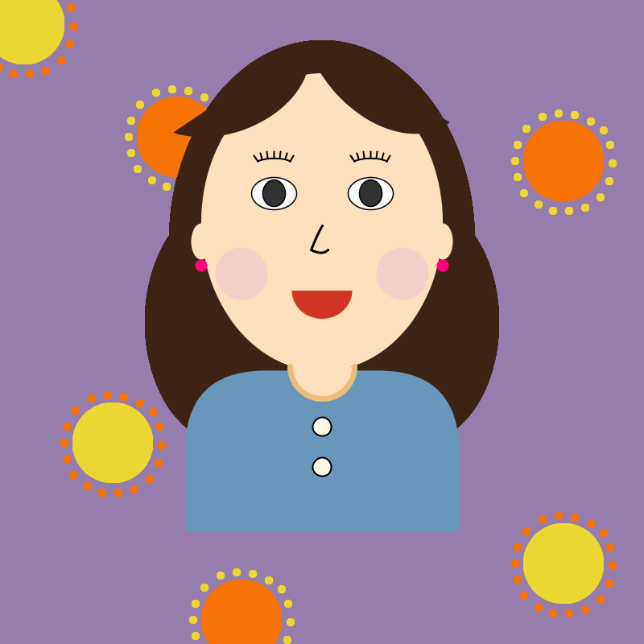
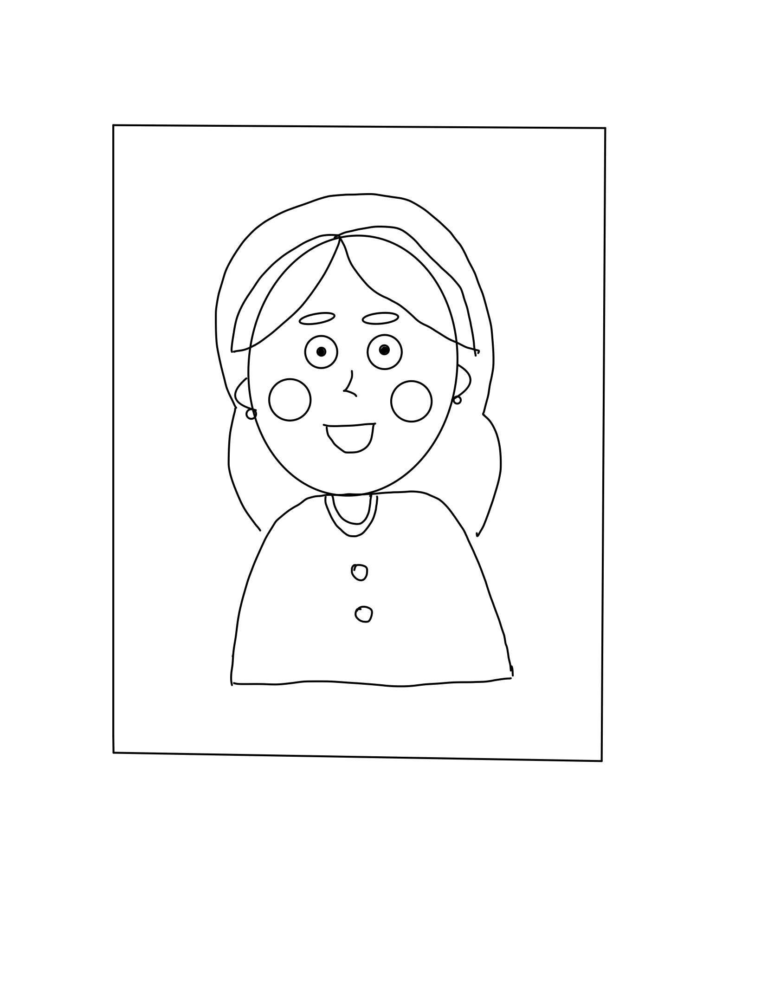

# Assignment 1:Processing Self Portrait 

## Project Description
This project is a self-portrait drawn entirely by code using basic drawing functions in Processing. I used simple shapes to create a cartoon-like self-portrait. Since this is my first project using Processing, the main focus was on understanding the principles of coding. I mainly used simple shapes such as circle, ellipse, rectangle, and strokes, instead of making a realistic representation of myself. I focused on capturing the character and personality of myself in the portrait. The scope of this project was to create a non-dynamic static image but as I was exploing different features on processing, I added some dynamic animation features like changing colors, moving eyebrows, and enlarging blush to make it more engaging for the viewers. 

Below is the image of my final self portrait:

and this is the animated version of my portrait:

## Process 

1) After class, I was so excited to try out things that I learnt in the class that I started to code directly on Processing Program. Since this was my first time drawing by code, it was not easy for me to visualize or translate image to code simultaneously. Therefore, although it seemed like an extrawork, I decided to sketch the outline first. On my ipad, I used simple shapes to sketch out the portrait of myself as shown below:

2) Based on this sketch, I started to code one shape at a time. When coding shapes, I depended greatly on https://processing.org/reference/ reference page to learn code languages and applied them to this project with my own twist. 

3) I started with big structure of the body such as an ellipse shape for the face and the rectangle shape for the upper body. I then filled in smaller elements like eyes, nose, mouth and earings. 

4) As I create shapes, I experimented with colors and carefully assigned colors to the shapes.  

5) Originally, I did not plan to design background but I decided to create a background that represents the personality of myslef, hence I added some sunshine patterns. 

6) After inputting all the shapes and background patterns, I added simple animations that changes colors, positions, and sizes. 

7) Finally, I reviewed codes to make sure that they are indented properlly, and got rid of the unnecessary comments or sentences. 

8) To export the final project, I used  saveFrame("line-######.png") function to save each frame and I used online GIF converter to create a GIF file. 

## Challenges 

Here are some of the challenges that I faced:

### *Positioning & Sizing*

Daniel shiffman's article https://processing.org/tutorials/drawing/ was very useful for me to have a basic understanding of coordinate system in Processing programme. However, to position shapes in relative to other shapes were much more challenging than expected. It was a very tedious process for me to position shapes at the exact place where I want it to be placed. It was especially challenging when positioning eyelashes. 

### *Rotation*

When I was coding bangs, I used the function **rotate(radians())** to rotate semi-circle shapes but as I run the program, it was not only semi-circles that were rotated but all of the following shapes were rotated and distorted the entire image. After a few trials and errors, I realized that I need to rotate it back to original angle to prevent following shapes from rotating. 

Apart from this, positioning and coordinating shapes after the rotation were also very complicated. I was able to position shapes using negative values for x or y axis but I still don't understand how positioning works after rotation. I would like to learn this in upcoming lesson.  

### *Customizing shape: Drawing Bezier Curves*

Since the nose shape required more sophisticated curves, I could not use simple polygon shape. Instead I had to customize the shape. After some research, I found out that I can use Bezier curve to customize shape, but since I had limited understanding of the concept of Bezier functions, it took me a while to understand how x and y coordinates control the curve of the line. I was able to create the nose shape I wanted but I still need to explore more to fully understand this function.

### *Color Choices*

Another challenge was to understand the RGB values. Since I am used to linguistic representation of colors, it was difficult for me to use numbers to generate colors that I have in mind. Therefore, for a defined color such as maroon color, I searched the name of the color online, and translate it to HEX value. Even then, since there are so many varieties of Maroon colors, it was a tedious process for me to find the exact color that works well with the rest of the colors. 

The greatest challenge was coding colors for sunshine patterns for the background. I wanted the color to change randomly but I didn't know how to do this. After some research, I found out that I could code the span of R,G, and B values, but it was a tedious process finding a spectrum of RGB that will give me the color that I want. I did not want the color to change too subtle but I also wanted it to stay in the spectrum of bright yellow and orange colors. After a few trials I found a good RGB range that gives me a color animation that I want. 

## Reflection/Evaluation

Overall, although it was a long tedious process for me since I had to learn everything from the scratch, I enjoyed working on this project. I am very satified with the outcome. This project took me roughly 10 hours as it was my first time using processing. However, during the process, I discovered the potentials of computational drawing and I am really excited to explore its unlimited potential. 

One interesting point that I found out working on this project is that although it is a 2D image, to code this image, I had to think it as a 3D space since I had to layer shapes. For example, on the surface, it looks like a flat image, but to compute it, the hair ellipse had to be drawn first, followed by the face ellipse, eyes, pupils, and so on. If I layer them in different order, it will generate a completley different image. Therefore, in this sense, I had to think not only x-axis and y-axis, but z-axis as well. 
