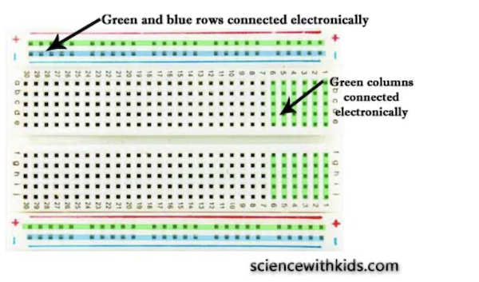

# Arduino Assignment 1: Analog VS. Digital(Dial to Find Out the Missing Parts of the Story!)

## Description 
For This week, I was instructed to build Arduino Project that gets information from at least one analog sensor and at least one digital sensor, and use this information to control LEDs, in some creative way. Following the instruction, I made a fun challenge where you dial potentiometer to receive a light pattern puzzle and solve the puzzle to find the missing words for an incomplete story. To begin, follow the instruction below! 

**Instruction:**

1) Run the program
2) Dial the potentiometer clockwise to receive the light patterns (There are four patterns in total). 
3) For each pattern, identify the light that is blinking at a slower rate than the rest. (The color of the light is the answer)
4) When you know the answer, press the matching color button to check if it is correct.
5) If you press the correct button, the green light on the top left corner will light up.
6) Find the answer for all four patterns, and fill in the blank with those answers to finish Soojin's incomplete story.

**Below is Soojin's Story with missing words**


*I had a very weird day yesterday. I woke up, opened the window and the sky was (--- First Pattern Answer
  ----) and all the cars on the street were (---Second Pattern Answer---). I wore my favorite (--- Third Pattern Answer ----) sweater and left my home.
  On the way to school, I saw such a beautiful bird with (---Fourth Pattern Answer---) feathers. What a day!*

For analog, I used potentiometer that makes four different patterns of light by turning on a specific LED with fast or slow blink on the value you turn it to, and for digital, there are four buttons that you can press to check your answer. 

## Schematic
The schematic for this project is below:


## Final Circuit


## Final Game Demo

[](https://youtu.be/YMRoeIXkoDQ)

Below is the GIF of four patterns you will receive when you dial potentiometer. 
They are in order of the answer. 


## Try it Yourself!!

Can you find which light is the answer? It is not easy but if you look carefully, you will be able to find a light that is blinking at a different rate from the rest. Observe carefully :)) 

### YELLOW blink fast


### RED blink fast


### GREEN blink fast


### BLUE blink fast


## Challenge & Process Explanation 

### Draw Schematic First
Following Professor Michael Shiloh's advice, for this project, I started with drawing schematic, then I built the circuit. Since I had a profound idea on what functions I want my circuit to have, drawing schematic without a physical circuit was not as challenging as I thought it would be. However, because it was my first time using potentiometer, I didn't know the symbol of potentiometer for schematic. When I searched on Google, there were different symbols used for potentiometer, each symbol slightly different from one another. I ended up using a potentiometer symbol from https://qxf2.com/blog/arduino-tutorials-for-testers-light-dimmer/ this website. When drawing a schematic, I made sure I assign Potentiometer (Analog Input) to A0-A5, and LED Lights to six PWM pins (3, 5, 6, 9, 10, and 11), in case I use lights for Analog Outputs.

### Build & Rebuild Circuit
When I start building the circuit, I focused on the functionality of the circuit. I wanted to build it in a way that it is easy for users to press buttons, dial potentiometer, and be able to see LED lights without being blocked by wires or the resistors. It was challenging because for this project, I used a lot of inputs and outputs; five lights, four buttons, and a potentiometer. I first built a circuit and I had to completely remove everything, and rebuild it. I repeated this several times to build a clean circuit that I was satisfied with. The key thing that helped me to build a clean circuit was to understand the electricity flow of the breadboard; knowing which rows or columns are connected electronically helped me to build more efficient circuit. I found the information on this website https://sciencewithkids.com/Experiments/Energy-Electricity-Experiments/how-to-control-multiple-LEDs-with-arduino.html. And below is an image that explains which rows/columns are connected electronically.



Another thing that helped me greatly was to realize that the order of wire, resistor, and the Input Source (LED light or Button) do not impact the functionality of the circuit. As long as they are connected, they will do the job. 

### Use millis() instead of delay()

Since the program run under loop, when I used delay() to make the lights blink, there was an issue because the delay function paused the program for the amount of time specified as parameter. To solve this issue, I used millis function, which simply returns the number of milliseconds that have passed since program start. Using millis(), I was albe to continuously run the code without having to wait. It took me a while to understand the concept of millis() and learn how to code in a way that works for my project. 


````
//Declare Time variable for Blinking Slow or Fast
unsigned const long BlinkSlow = 200;
unsigned const long BlinkFast = 100;


//Declare Starting Time as zero
unsigned long previousTimeSlow = 0;
unsigned long previousTimeFast = 0;
````
````
   //RED Blink Fast
    if (currentTime - previousTimeFast > BlinkFast) {
      previousTimeFast = currentTime;   //save the last time you blinked the LED
      //if the LED is off turn it on and vice-versa:
      if (ledState == LOW)
        ledState = HIGH;
      else
        ledState = LOW;

      // set the LED with the ledState of the variable:
      digitalWrite(redLEDpin, ledState);
 ````

To explain, for fast blink as illustrated above, the time starts from 0, which is initialized as PreviousTimeFast. Then CurrentTime counts the milliseconds that have passed since the program start. And when the difference between currentTime and the previousTimeFast reaches 1000 milliseconds, the LED light blinks. Also everytime it reaches 1000 millisecond, the currentTime is reset as previousTimeFast, which is 0. Therefore, the loop of a light blinking in every 100 milliseconds if formed. To Blink, I used if() and else() statement that turn on the LED when it is on and vice-versa. 

I was not familiar with the scale of millisecond so first, I set the Fast blink as 100 milliseconds and slow blink as 200 milliseconds, which I could not see the difference with my eyes. Later, I found out that 1000 milliseconds is only one second. So I rescaled it as 1000 millisecond and 2000 millisecond for the fast and slow blink.

## Answer / Complete Story

**I had a very weird day yesterday. I woke up, opened the window and the sky was YELLOW and all the cars on the street were RED. I wore my favorite GREEN sweater and left my home. On the way to school, I saw such a beautiful bird with BLUE feathers. What a day!**


