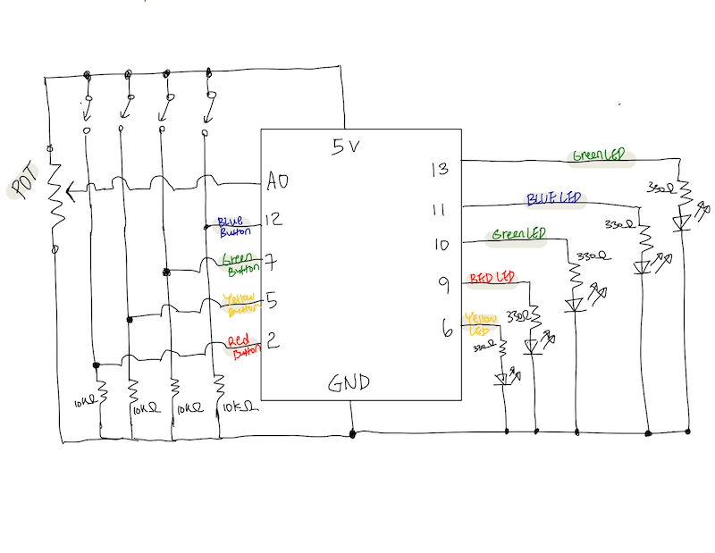
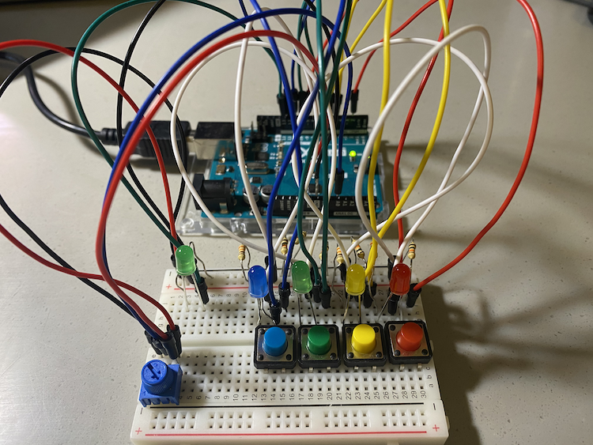
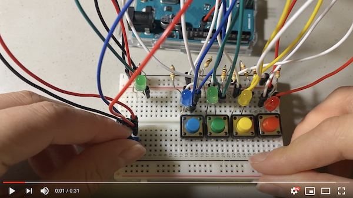

# Arduino Assignment 1: Analog VS. Digital(Dial to Fill in the Blanks!)

## Description 
For This week, I was instructed to build Arduino Project that gets information from at least one analog sensor and at least one digital sensor, and use this information to control LEDs, in some creative way. Following this instruction, I made a fun challenge where you find a missing words for a story. To find the missing words, you need to dial potentiometer and solve a pattern to get an answer. Here is an instruction!

**Instruction:

1) Run the program
2) Dial the potentiometer clockwise to receive a light pattern (There are four patterns in total). 
3) For each pattern, find the light that blinks slower than the rest.
4) When you know the answer, press the matching color button to check if it is correct.
5) If you press the correct button, the green light on the top left corner will light up.
6) Find the answer for all four patterns, and fill in the blank with those answers to finish Soojin's story.
7) Below is Soojin's Story with missing parts.

**I had a very weird day yesterday. I woke up, opened the window and the sky was (--- First Pattern Answer
  ----) and all the cars on the street were (---Second Pattern Answer---). I wore my favorite (--- Third Pattern Answer ----) sweater and left my home.
  On the way to school, I saw such a beautiful bird with (---Fourth Pattern Answer---) feathers. What a day!

For analog, I used potentiometer that makes four different patterns of light by turning on a specific LED with fast or slow blink on the value you turn it to, and for digital, there are four buttons that you can use to check your answer. 

## Schematic
The schematic for this project is below:

## Final Circuit

## Final Game Demo

Below is the GIF of four patterns you will receive when you dial potentiometer. 
They are in order of the answer. 

### YELLOW blink fast

### RED blink fast

### GREEN blink fast

### BLUE blink fast

## Challenge & Process Explanation 

