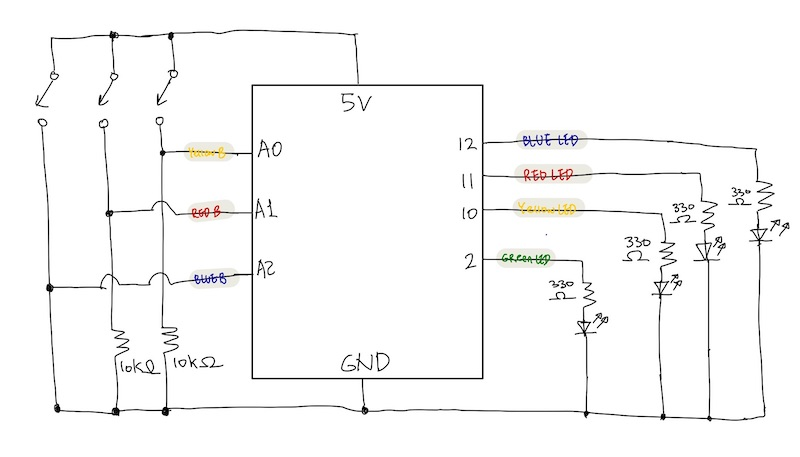

# Arduino Assignment 1: Confusing LED Light Game

### Description 
For this week's assignment we were instructed to use at least three momentary switches, and at least three LEDs to create a puzzle/game that can be solved by pressing the buttons. Following the instruction, I made a game where you are given a pattern of light and you need to press the button(or buttons) that matches the light pattern. Warning! I added a twist to this game to confuse you, so be careful! The color of the buttons does not matches with the color of the light. So you will need to first learn which button matches with which color of the light before you start the game. After you finish learning, you start the game. In total, you have five levels to complete to win the game! 

### Ideation 
When I tried to make a game with LED lights with different colors, one game came to my mind. It is the game that you have to look at the chart and say the COLOR not the word. 


It is confusing because your right brain tries to say the color but your left brain insists on reading the word. Inspired by this game, I decided to add a confusing element in the game to make the game more fun to play. Hence, I added a twist where players have to press matching button, not the button with the same color with the light.  

### Game Instruction 
1) Start the Program

2) Learn colors: Click buttons to learn what color does each button represents

   - Blue Button => Yellow LED
   - Red Button => Blue LED
   - Yellow Button => Red LED
   
3) Start Game: Once you are confident that you have learnt what color button corresponds to what color light, press all three button simultaneously to start the game. Green LED Light will blink to indicate that the game is starting. 

4) Playing Game: See the light pattern and press the corresponding button that will light up the same pattern. If you press the correct button, green light will blink and proceed to next level.

5) Win the Game: Complete all five levels, then you win the game! (all the lights on the board will blink 3 times to congratulate you and restart the game)

### Schematic
The build of the final schematic is below:



### Final Picture
The build of the final breadboard is below:


### Final Game Demo
The demonstration of the game is below: 

[](https://youtu.be/LDsbpfi08Vc)

### Process

1. First I built the setbacks
- When I press the button, the button responds to matching color LED
- The light turns off after 500 delay


````

 if (digitalRead(yButton) == HIGH) {
    digitalWrite(yLED, HIGH);
    delay(500);
    digitalWrite(yLED, LOW);

  }

  if (digitalRead(rButton) == HIGH) {
    digitalWrite(rLED, HIGH);
    delay(500);
    digitalWrite(rLED, LOW);

  }

  if (digitalRead(bButton) == HIGH) {
    digitalWrite(bLED, HIGH);
    delay(500);
    digitalWrite(bLED, LOW);

  }
````

### Challenge:
I struggled with connecting switch with the light. 

When started the program, the light turns on without switch but once I have switch involved, the light did not turn on. 

The issue was that I connected the same leg button to both ground and the 5 volt supply. 


