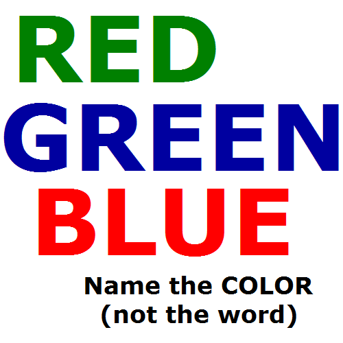

# Arduino Assignment 1: Confusing LED Light Game

## Description 
For this week's assignment we were instructed to use at least three momentary switches, and at least three LEDs to create a puzzle/game that can be solved by pressing the buttons. Following the instruction, I made a game where you are given a pattern of light and you need to press the button(or buttons) that matches the light pattern. Warning! I added a twist to this game to confuse you, so be careful! The color of the buttons does not matches with the color of the light. So you will need to first learn which button matches with which color of the light before you start the game. After you finish learning, you start the game. In total, you have five levels to complete to win the game! 

## Ideation 
When I tried to make a game with LED lights with different colors, one game came to my mind. It is the game that you have to look at the chart and say the COLOR not the word. 

It is confusing because your right brain tries to say the color but your left brain insists on reading the word. Inspired by this game, I decided to add a confusing element in the game to make the game more fun to play. Hence, I added a twist where players have to press matching button, not the button with the same color with the light.  

## Game Instruction 
1) Start the Program

2) Learn colors: Click buttons to learn what color does each button represents

   - Blue Button => Yellow LED
   - Red Button => Blue LED
   - Yellow Button => Red LED
   
3) Start Game: Once you are confident that you have learnt what color button corresponds to what color light, press all three button simultaneously to start the game. Green LED Light will blink to indicate that the game is starting. 

4) Play Game: See the light pattern and press the corresponding button that will light up the same pattern. If you press the correct button, green light will blink and proceed to next level.

5) Win the Game: Complete all five levels, then you win the game! (all the lights on the board will blink 3 times to congratulate you and restart the game)

## Schematic
The build of the final schematic is below:

## Final Picture
The build of the final breadboard is below:

## Final Game Demo
Find the demonstration of the game below: 

1) Click BLUE, RED, and YELLOW buttons one by one to learn what color LED light each button represents.
2) Click all three BLUE, RED, and YELLOW buttons simultaneously to start the game => Green light blinks!
3) Yello light turns on => that means you have to click blue button
4) Press Blue butto => Green light turns on to indicate it is correct.
5) Continue game until you finish level 5
6) Once you finish level 5, all the lights on the breadboard blinks 3 time and restarts

## Challenge:

### Declare LED light as Output ###
When I first made a simplet setback to test the program and to check if buttons are triggering output, I faced an issue of LED lights lighting up very dim.
Although it was responding, 
When I did not delcare LED lights as output, the lights were so dim.
Once I declared lights as output, all LED lights were on with bright light. 

### Switch Connection ###
I made a mistake on connecting the same leg button to both ground and the 5 volt supply. Since they were connected to the same leg, I could not use the button. I spent so much time trying to fix the code, yet I could not solve the issue!. Later it turned out that I could never solve it because essentailly, issue was at the breadboard itself. Unlike previous software-based processing process, for Arduino project that requires both physical and digital computing, it is challenging to figure out whether the issue is on the computer programming or the setup of the arduino physical product. 

From this experience, I learnt a lesson that it is important to check both the code and instead of  recognize the source of the issue before trying to

### Learning New Languages ###
Although it was very similar to Processing language, it took me a while to learn Arduino Program Language.
I learnt new function, variable and structural languages like 
- digitalRead()
- digitalWrite()
- pinMode()
- OUTPUT
- INPUT
- HIGH
- LOW

I used https://www.arduino.cc/reference/en/ Arduino reference page to search specific terms.

One thing that I liked about Ardunio Program Language was that I could use **and** **or** as a word unlike Processing where I having to learn new language that represents the meaning of this. 

