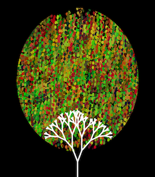
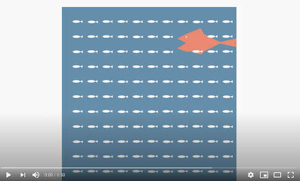
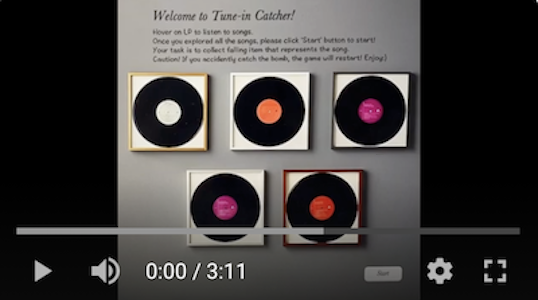

# Intro to IM

# Welcome

Welcome to Soojin's Interactive Media class Github Repository. In this page, you can find weekly digital artworks and games that I created using Processing and Arduino. Click on each item to see the project and its process documentation. Hope you enjoy :) 

# Project Gallery

## [Processing Self Portrait | January 26, 2021](https://github.com/Soojin-Lee0819/IntrotoIM/tree/main/January26) 
### Title: Soojin's Portrait

                                            
## [Processing Computer Graphic Artwork | Febuary 2, 2021 ](https://github.com/Soojin-Lee0819/IntrotoIM/tree/main/Feb2) 
### Title: Patterns in Nature

## [Object Oriented Programming | Febuary 9, 2021 ](https://github.com/Soojin-Lee0819/IntrotoIM/tree/main/Feb9) 
### Title: The Underwater Foodchain

## [Data Visualization & Generative Text | Febuary 16, 2021 ](https://github.com/Soojin-Lee0819/IntrotoIM/tree/main/Feb16) 
### Title: Special Full-Course Dinner Reservation 

## [The Processing Game | March 3, 2021 ](https://github.com/Soojin-Lee0819/IntrotoIM/tree/main/midtermProject) 
### Title: Tune-in Catcher

