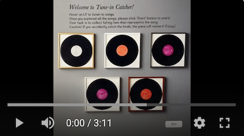
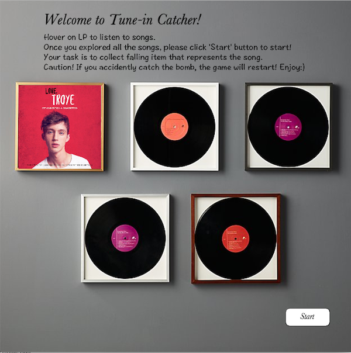
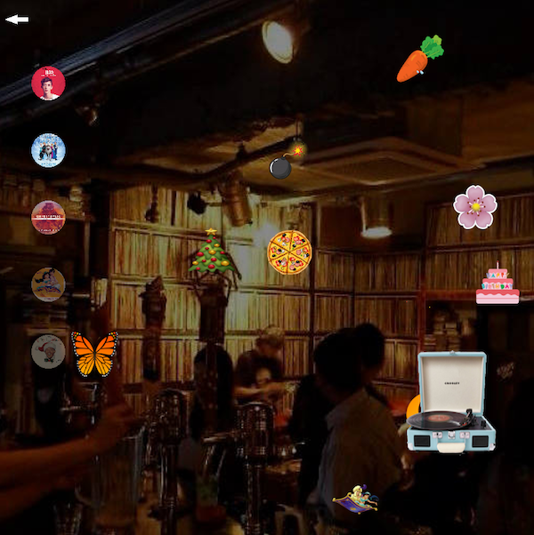

# Production Midterm: 'Tune-in Catcher' Processing Game

## DESCRIPTION
'**Tune-in Catcher**' is an audio-visual game that invites players to play with both image and sound. It is a game where players listen to music and catch falling objects that match the song that is being played, while avoiding bombs! For instance, if the song "Do you want to build a snowman" from the movie Frozen, is being played, among many other items that are falling from the sky, player have to catch the snowman icon. The aim of this game for th players is to complete catching all five songs without getting hit by the bomb. Playing this game, I hope players to have fun cathcing items as well as enjoy listening to some of my favorite songs! 

## IDEATION 
Listening to music is one of the essential daily routine of mine. I listen to music almost all the time; when I wake up, when I study, and even before I goto sleep. It  companies me throughout the day, elevate my mood and brings a great deal of joy in my life. Therefore, through this music game, I wanted to share the joy I get from listening to music with others. 

## INSTRUCTIONS

Below is the YouTube video of demonstrating how to play the game. 
Click on the image to watch the demonstration video. 

### Tune-in Catcher Demonstration Video 

### Landing page 

When players run the program, they are met with the landing page. 

   
 
 On this landing page, players can find an instruction. Following the written insstruction, players are supposed to hover mouse on LP disks to listen to songs. Each LP contains different song album images and songs. When the mouse is hovered on LP disk, the song will start to play and continue to play until the player remove the mouse away from the LP disk. Explore all five songs and once the player is familiar with the songs, they can click **Start** to start playing the game. 
 
### Game Page

When the game starts, the song will play as well as the falling item animation. 

   

Players job is to listen to music, identify the item that matches the song, and use keyboard to move the record player and catch the matching items.
Players can use left and right direction keyboards to move around the record player. 
Meanwhile, players also have to avoid touching bomb icon. 

By clicking return button on top left corner, players can return to the landing page. Otherwise, players continue to play game. 

Once the player catch the correct item, the light will be turned on for the song that they just catched and the music will change. 
Players repeat this job until they catch icons for all five songs. 

Below is the image of the screen half-way through them game when players have collected three songs (three lighted song images on the left side of the screen) and still have got two more songs to catch:

   
 
 If the player fails in avoiding bomb icon and  accidently catches bomb icon, the game automatically stops and returns to the landing page. 
 
 ### End Page
 When players have successfully caught all five songs without hitting the bomb, the game ends and players are met with the endpage. 
 
    
 
 Here, players will receive a contragulations message on winning the game by successfully collecting all five songs! They are also met with the instruction on how to listen to collected songs. Players are able to enjoy and listen to songs by clicking on the playlist and can stop the song by clicking it again. If tehy want to restart the game, they can click Restart button to play it once more! 

Here is the list of songs available for Tune-in Catcher:

 - Strawberries & Cigarettes by TroyeSivan
 
 - Do You Want To Build a Snowman? by KristenAnderson-Lopez & Robert Lopez
 
 - Counting Stars by OneRepublic
 
 - A Whole New World by Zhavia Ward & Zayn Malik
 
 - White Christmas by Bing Crosby

## Process & Journal

To Read the process of making this game project that includes day by day progress, challenges and iterations,

Please visit [link to section](https://github.com/Soojin-Lee0819/IntrotoIM/blob/main/midtermProject/journal.md)

## Reflection & Evaluation 

Working on this project, the biggest challenge was

While previous projects were one dimensional, in a sense that there is one working page, this project is in layers where while one action is happening that will lead to another action and etcetera. 
