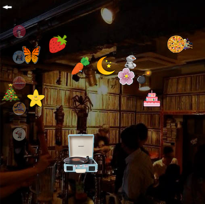
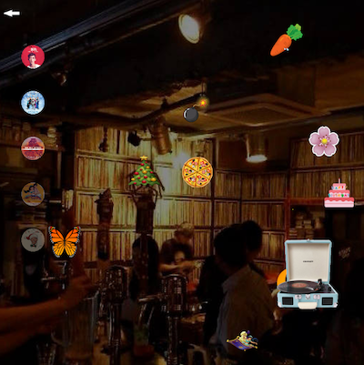
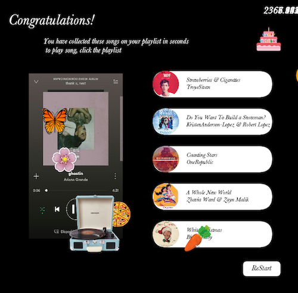

# Tune-in Catcher Journal

Following is the digital journal on creating a Tune-in Catcher. This page explains step by step progress and learning outcome on making this processing game. 
It includes daily progress, challenges that I faced and iterations that I made. 

## Feb17.2021

### Brainstorm 
Following the instruction to create a game that includes shape, image, sound, and on-screen text, I brainstormed on what game I want to create. From the beginning, I wanted to create a game that is built around the music. I wanted to creatively elaborate sound element on the simple game like catching objects. 

I had two ideas in mind:

1) First idea is the game called **Re-writing song** where players catch words that are falling from the sky and these collected words will be replaced with the lyrics of a song, hence players are rewriting a song.
   
2) Another idea is the game called **Tune-in Catcher** where players listen to the song and colelct matching icon that represents the song that is being played. 

For this midterm project, I decided to work on the second idea. 


## Feb18.2021

### Progress 

**Collecting Image**
- I collected png images for the falling Items. 

**Falling Item Animation**
- I coded basic animation of Items falling from the sky using void fall() that changes y position with added speed.
- I used void collision() that checks item colliding with the ground height and once it reaches the ground, I made it to go back to the sky. 
- I radomized the item speed to add some variation to the animation. 
   
 ```Processing
 void fall() {
    itemCoordinatey=itemCoordinatey+itemSpeed; //To start Item falling Action
  };

  void collision() {
    if (itemCoordinatey>=height-70) { // if item collides with the ground height - item size
      itemCoordinatey=-100;// it goes back to the sky
      itemCoordinatex=int(random(70, 830)); //reset x position a nd speed
      itemSpeed=int(random(3, 13));
    };
  };
```


**LP player Keyboard Move** 

- I set a move function for the Recorder by changing recordCorrdinatex; where the x coordinate of record moves to the right by adding +10 and moves to the left by eliminating -10.

```Processing
  void move() {//controls the direction of the record from keyboard and restrict it from going out tf the window
    if (left && x>0) {
      x=x-10;
      recordCoordinatex=x;
    }
    if (right && x<800) {
      x=x+10;
      recordCoordinatex=x;
    }
  };
```
- I animated LP player to move left or right using keyPressed(); and keyReleased(); function and boolean. 

```Processing
  void keyPressed() {
  if (keyCode == LEFT) {
    left=true;
  };
  if (keyCode == RIGHT) {
    right=true;
  };
}


void keyReleased() {
  if (keyCode == LEFT) {
    left=false;
  };
  if (keyCode == RIGHT) {
    right=false;
  };
};
```

It turned out to be like this:


**Challenge**
   - Icons are falling but they are leaving the tracemarks. 
   - Every movement is captured and continuously displayed on the screen. 

## Feb19.2021

### Progress

**Redrawing Background**

- I fixed the issue of continuous visualization of the moving icon by redrawing the background 
- In this way, new background is drawn every time the object is moving and covers the previous frames

``` processing
void redrawbackground() { //redraw background every time the object is moving
  image(background, 0, 0, width, height);
```


**Creating Landing Page**

- So far I have created a gamepage, which is displayed once the game has started. 
- Before players actually begin the game, I wanted them to trigger some action, such as clciking a mouse to start the game. 
- I started with desinging landpage. 
- I created a landing page with an image of LP players hung on wall. 
- When users hover on the LP, it shows the album cover of the song. 
- This is done so that players can listen to and explore the songs before they start the game. 
- For now, it is only the image of the song but later when I learn how to embed audio files, I will add sound where on hover, the sound starts to play.


### Challenges

**Make Timer Visible**

- I added Timer with a void countUp(), starting with Timer(0) that update the timer by counting up that begins with value 0.

- Timer is displayed behind the playgame page that it is invisible

- To solve this issue, I switched the order of drawing. By displaying Items, Record and playgame page first, followed by Timer, timer is visible as it is displayed in front of the images. 


## Feb20.2021

I haven't made much progress today. Instead, I edited journals and redesigned background for the gamepage. I wanted to give an experience of players to feel like they are playing this game at a cozy cafe. Therefore, I changed the backgorund of the gamepage to an image of an antique LP cafe.

I manipulated the image transparency and set the background black to make the image become darker. 


## Feb21.2021

### Progress

**Add Start Button**

-  Added Button to start the game.

   ```
   void mouseClicked() {
     if (mouseX >  650 && mouseX<  750 && 
    mouseY > 700 && mouseY < 750) {
    setup();
    landPage = true;
    startGame = false;
    }```
  
**Add Instruction**

- Added written Instruction text using string. 

**Add Return Button** 
- Add return button on the gamepage for the users to stop playing the game and go back to the landpage. 

### Challenge

**Reset & Restart**
- It was challenging to figure out how to restart the animation everytime user click the start button.
- In order to restart, I have added setup(); to click (start) button so that everytime when user starts the game, it resets the setup, hence starting a new game. 

 
 
- Frames are not saved completely. Only some part of the display is saved as a gif file but this gif file still shows that whenever start button is pressed, it the animation resets and restarts the game. 
 
## Feb22.2021

### Progress

**Create EndPage**
- I created an endpage
- The challenge now is to have this endpage appear when the game is ended. I have not yet finished the gamepage functions. So I will do this later when I am done with the game page. 

 

## Feb 23.2021

### Progress

**Catch Icon Animation**

- By creating a function that evaluates the distance between the falling item and the record, and trigger an event when the distance between the two are less than 50, an overlapping distance, I was able to create a catching Icon animation

   ```float touch = dist( Items[i].itemCoordinatex, Items[i].itemCoordinatey, record.x, record.y);
   (touch < 50) {
          Items[0].erase();
   ```

- When Record catches the falling item, I want the image of the icon to be deleted from the display.
- However "delete" or "remove" is not an available function on processing
- Therefore, I manually created a function erase();

```
  void erase() {
    itemSpeed = 0;
    itemCoordinatex = 1000;
    itemCoordinatey = 1000;
    };
  ```

- For the function erase, I set the speed to 0 and translate the item position off screen, which by deleting the item, it makes player feel like they have captured the item.

**Add Song Image Icons to gamepage**

   

- I added the song cover album icons to the side of the gamepage. 

- This icon is added to indicate players what songs they have successfully collected the song. 

- When the player successfully catches the icon falling from the sky that matches the song, the icon image of the song on the side will be lightened.

- Originally, I did not have song album images in array() so all the images will be lightened up whenever the player cathes an icon.

- I wanted to set in a way that when a specific item is caught, a specific icon to light up. 

- Therefore I created an array list for the song album images. 
```
 Song (int num) {
    songType=num+1;
    songCoordinatex=0;
    songCoordinatey=(num+1);
    songSize=50;
  }

  void display() {
    String Songimgname="img/Song"+str(songType)+".png";//generate img name for song
    PImage Song;
    Song=loadImage(Songimgname);
    tint(255, tintValue);
    image(Song, songCoordinatex+50, songCoordinatey*100, songSize, songSize); //load image for song
  };
```
- For the image to light up, I made a function called displayBright(); and adjusted the tint value from int (100); that changes to tint = 255, maximum tint.
 ```
 void displayBright() {
     tintValue = 255;
     display();
```

### Challenge 

**Song image icon light up for one frame only**

- After animating the song cover image to light up when the player catches the item, I was stuck with not knowing how to let that image lightened up until the end of the game. 

- The issue was that the icon image becomes brighter for a second, when activated but then it goes back to original dark tint. 

- I did not know why it does not stay in bright tint and I was stuck with this issue for almost an entire day. I thought it has to do something with the order of sequence which makes it go back to dark after animation.

- However the issue was that I wanted the light to be on but it would only flicker and once the position is moved off screen, since the distance between recorder and the icon is too far away, the function touch() is no longer true; that the light only flickers for a second and gets dim again.
 
- Therefore, instead of removing an item by changing the coordination I created the same effect of making icon disappear by reducing the size of the item to 1.

- This way, since it does not affect the distance between the recorder and an item, the brightness of the song icon image did not go back to dim mode. 

```
  void erase() {
    itemSpeed = 0;
    itemSize = 1;
    };
  ```
When figuring this out, although it only required a simple trick, since I did not approach the issue from this direction, it took me a lot of time finding out how to solve this issue. Through this experience, I learnt that sometimes I need to sit back and try to think about what are some other approches I can take to solve rather than restricting myself on having one solution to solve a problem. 

## Feb 24. 

### Progress

**Loaded sound**

- After learning how to load soundfile on Processing, I added sound to the program by importing sound from the file and identifying soundfile by its name on setup();

```
  file = new SoundFile[numsounds];
  for (int i = 0; i < numsounds; i++) {
    file[i] = new SoundFile(this, (i+1) + ".mp3");
  }
```

- I first added sound on the landing page where players can hover on the LP to listen to the song

### Challenge 

**play sound is triggered multiple times**

- For the landing page, when the player hover on the LP, as long as the mouse is on the LP image the action hover() is triggered continuously that the song were repetitively played simultaneously. I wanted a song to play once while the mouse is hovering on the LP. 

- I solved it by adding file[].isPlaying() function. 
   ```
    if (mouseX > 42 && mouseX < 230 && 
      mouseY > 193 && mouseY < 383) {
      displaySong1();
      if (file[0].isPlaying()) {
        println("File1is playing");
      } else {
        file[0].play();
      }
    } else {
      file[0].stop();
    }

   ```
   - So the program first checks if the song is being played.
   - If the song is currently being played, it prints line that File is Playing and does not play any more sound.
   - If nothing is playing, it starts to play the sound file.
   - Then, if the mouse is no longer hovering on the LP, the file stops playing. 
   
 ## Feb 25
 
### Iteration
- It was a great challenge for me to figure out how to play a random song once the game starts, stop the song when the player catches the item, and play another song that is not the one that was played previously.

- One way to do this is to create an arraylist and eliminating the songs that were played and randomly choose from the songs that are only in the arraylist
- However, given the scope of this project and my skills to code this was a bit too complicated.

- Therefore, I made an adjustment to the program. 

- To make it a bit less complicated, instead of instead of playing a random song, I decided to load songs in order and the goal of the user is to successfully completing all five items without hitting the bomb. 

- This way, I don't have to worry about random selection of songs.

### Progress

**Start game play sound**

- After making an iteration on the game, I added a feature where the file[0], the first song on the list to play as soon as the game starts. 

```
   if (file[0].isPlaying() == false && file[1].isPlaying() == false &&  file[2].isPlaying() == false &&  file[3].isPlaying() == false &&  file[4].isPlaying() == false) {
      file[0].play(); // if no sound file[] is playing, then play the first song file[0]
      println("File1is playing"); //to check is the file is playing well
    }
```
### Challenge

**How to play next song when Player catches the item**

- It was challenging to figure out how to automatically play the next song when the player catches the correct item. 
- For this, I will do it tomorrow. 

 ## Feb 26
 
 ### Progress
 
 **Play next song on catch**
 
 - I figured out how to let the next song to play when the item is caught.
 
 - This is by using if() statement where when item is caughted, stop currently playing sound file and play the next sound file. 
 ```
  if (i == 0) { 
        if (touch < 60) {
          Items[0].erase(); //make corresponding item, item [0]disappear
          Songs[0].displayBright(); //diaply song image with full opacity. Lights on!
          file[0].stop();//stop sound file [0] to play another sound file
          if (file[0].isPlaying() == false && file[1].isPlaying() == false &&  file[2].isPlaying() == false &&  file[3].isPlaying() == false &&  file[4].isPlaying() == false) {
            file[1].play(); // if sound file [0] has stopped, start playing next sound file sound file [1]
          }
        }
      }
 ```
 - I repeated this until the player reaches the last song. 
 
  **Complete all 5 Songs, then display endpage**
  
  - Similarly, I added the [ endpg.display(); & startGame = true; ] for the last song.

Below is the weird endpage where some items and left unerased.

 

Therefore, I added to make the page clear before it moves to the endpage. 
 
 ## Feb 27
 
 I have finished the project!
 
 Final version of this game is demonstrated in this youtube video down below:
 
 [](https://youtu.be/qE8WP0k1MyA)
 
