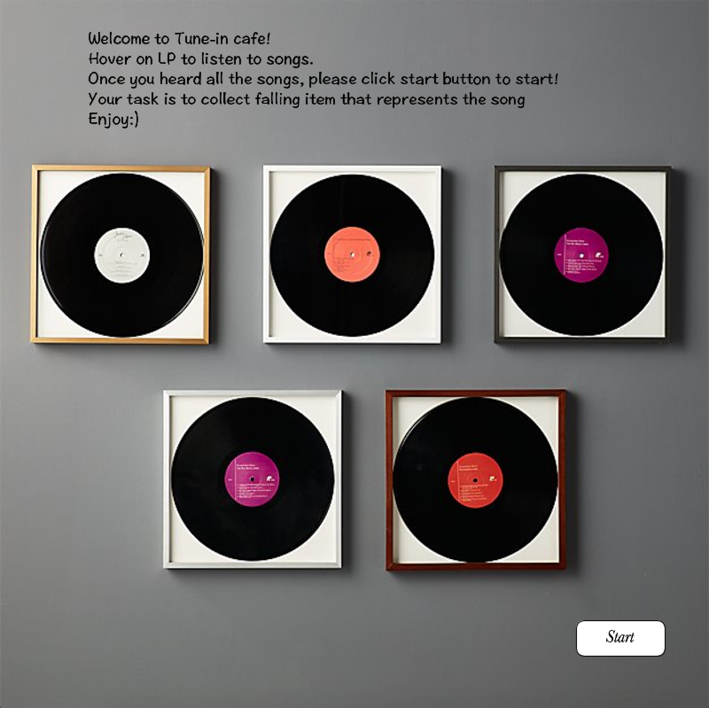

## Tune-in Catch Journal

### Idea & Project Description 

Listening to music is one of hte essential daily routine of mine. It is a powerful tool that controls my emotion, companies me thorughout the day that I listen to music almost all the time; when I wake up, when I study, and even before I goto sleep. Therefore, for this project, as sound was one of the required feature, I decided to make a game that has music as an integral part of the game. 

"Tune-in Catch"is a multimedia game that requires players to interacte with both image and sound. To briefly describe how this game works, it is similar to the oldschool "catch game" where players catch a falling object from the sky. The twist is that for the "Tune-in Catcher", users have to listen to the music and collect specific item that matches with the song that is currently being played. For instance, if the song "Do you want to build a snowman" from the movie Frozen is being played, among many items that are falling from the sky, player have to catch the snowman icon. The aim of this game for th players is to complete catching all these five songs in shortest timeframe. Playing this game, I hope players have fun trying to catch matching items as well as simply enjoying listening to music. 

Through this game I hoped to share some of my favorite songs with the users. Therefore, I incorporated some of my recent favorite playlist into the game. 

In total, there are five songs loaded for this game: 

- Strawberries & Cigarettes by TroyeSivan

- Do You Want To Build a Snowman? by KristenAnderson-Lopez & Robert Lopez

- Counting Stars by OneRepublic

- A Whole New World by Zhavia Ward & Zayn Malik

- White Christmas by Bing Crosby

<This is the manual on how Tune-in Catch is structured>
   
1. Read Instruction and explore songs
2. Click start button to start the game
3. The game begins 
4. The timer begins, items start to fall from the sky and the song randomly chose from the list starts to play
5. Listen to the song and try to identify the matching icon that is related to the song
6. Use direction keys to move LP recorder (basekt) and catch the icon that matches the song
7. If an appropriate icon is collected, the song changes to the next one
8. Repeat this until the player complete all five songs
9. Once complete, players will receive a congratulations letter with a music playlist which they can click and listen to. 
10. If player wish to replay, they can click restart button to replay the game. 

Following is the digital journal on the work progress. 

### Feb17.2021
Following the instruction to create a game that includes shape, image, sound, and on-screen text, I brainstormed on what game I want to produce. From the beginning, I wanted to create a game that is built around the music. For the game part, for the scope of this project, I wanted to creatively elaborate on the simple game like catching objects. 

I had two ideas in mind:

1) First idea is called <Re-writing song> where players catch words that are falling from the sky and these collected words will be replaced with the lyrics of a song that will be played throughout the duration of the game. 
   
2) Another idea is <Tune-in Catcher> where players listen to the song and colelct matching icon that best expresses the song that is currently being played. 

For this midterm project, I decided to work on the second idea. 


### Feb18.2021

**Progress** 
- I collected a png image for the falling Items 

- I coded basic animation of Items falling from the sky using void fall() that changes y position with added speed 
  and void collision() that checks item colliding with the ground height and looping it by make it go back to the sky when it reaches the ground. 
  
    ```processing
    void fall() {
    itemCoordinatey=itemCoordinatey+itemSpeed; //To start Item falling Action
  };

  void collision() {
    if (itemCoordinatey>=height-70) { // if item collides with the ground height - item size
      itemCoordinatey=-100;// it goes back to the sky
      itemCoordinatex=int(random(70, 830)); //reset x position a nd speed
      itemSpeed=int(random(3, 13));
    };
  }; ```


- I also animated LP player to move left and right using keyPressed(); and keyReleased(); function and boolean. 

void keyPressed() {
  if (keyCode == LEFT) {
    left=true;
  };
  if (keyCode == RIGHT) {
    right=true;
  };
}


void keyReleased() {
  if (keyCode == LEFT) {
    left=false;
  };
  if (keyCode == RIGHT) {
    right=false;
  };
};

It turned out to be like this:


**Issues**
   - One issue is that icons are falling down but all of its positions are captured in the frame; the movements of each are saved and continuously visualized.

### Feb19.2021

**Progress**

1. I fixed the issue by redrawing the background. 

void redrawbackground() { //redraw background every time the object is moving
  image(background, 0, 0, width, height);

so that new background is covered on top of previous frame to solve this problem. 


**Issue**
After adding background and adding renewbackground(); 

How do I make sure two items are not falling from the same x coordinate?


2. I added Timer 

Issue: Timer is behind falling images
Solutaion switch order of draw. Display Items and Record first then timer. Timer comes in front of images. 


3. Make Landing Page

I added landing page with lp players displayed on wall. On mouseClick(); the game starts


I started to design landingpage. I added song Album covers to each LP. When users hover on the LP, it shows the song and later when I learn how to embed audio file, the song starts to play. 

Users can listen to and explore songs before the start the game.


### Feb20.2021

Redesigned background for game page. 

### Feb21.2021

Progress
1. Added Button to start the game. 
2. Added Instruction text using string
3. Add return button on game page for users to stop playing the game or to restart. 
   In order to restart, I have added setup(); to click (start) button so that everytime when user starts the game, it is a new game. 
   
